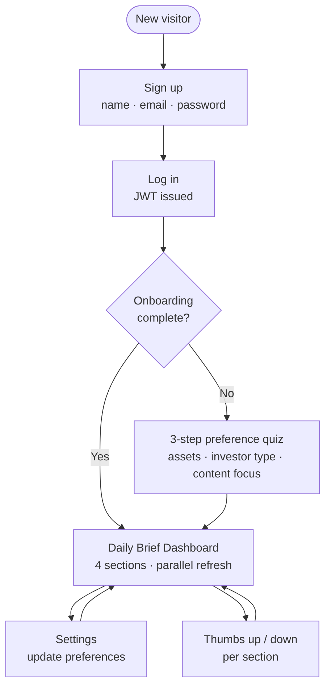
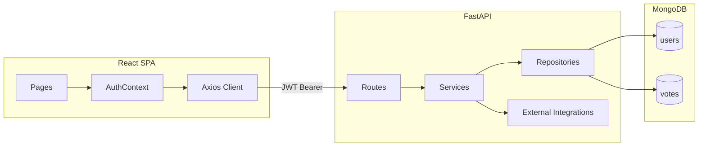

<p align="center">
  
</p>

<h1 align="center">Piggy Daily — AI Crypto Advisor</h1>

<p align="center">
  <strong>A personalized daily crypto brief.</strong><br/>
  Full-Stack Web Assignment · React · FastAPI · MongoDB
</p>

<p align="center">
  <a href="#live-demo">Live Demo</a> ·
  <a href="#the-idea">The Idea</a> ·
  <a href="#screenshots">Screenshots</a> ·
  <a href="#getting-started">Getting Started</a> ·
  <a href="#tech-stack--apis">Tech Stack</a>
</p>

---

## The Idea

Most crypto dashboards are cluttered with irrelevant data. **Piggy Daily** asks for your preferences first and builds a focused daily brief around them.

Users complete a short onboarding quiz to set their preferred assets, investing style, and content focus. The app uses this profile to fetch personalized prices, an AI summary, news, and a daily meme. Everything loads in parallel. The UI uses a clean, friendly design to keep things approachable rather than feeling like an overwhelming trading terminal.

---

## User Flow


---

## Live Demo

| Service                  | URL                                                          |
| ------------------------ | ------------------------------------------------------------ |
| **Frontend (Vercel)**    | `https://YOUR-APP.vercel.app` _(set in Vercel after deploy)_ |
| **Backend API (Render)** | `https://crypto-ai-dashboard-1f6g.onrender.com`              |
| **API Docs (Swagger)**   | `https://crypto-ai-dashboard-1f6g.onrender.com/docs`         |

---

## Screenshots

All screens captured at 1280×800.

### Login

<p align="center">
  
</p>

Clean auth layout with session-expiry handling.


Creates user account and redirects to login on success. Minimum 8 characters for passwords.

### Onboarding

<p align="center">
  
</p>

Required 3-step preference quiz. Determines what data is fetched on the dashboard.

| Step | Field            | Options                               |
| ---- | ---------------- | ------------------------------------- |
| 1    | Assets to track  | Bitcoin · Ethereum · Solana · Cardano |
| 2    | Investor profile | HODLer · Day Trader · NFT Collector   |
| 3    | Content focus    | Market News · Charts · Social · Fun   |

### Dashboard

<p align="center">
  
</p>

Four sections fetched in parallel. Section order adapts on the client based on content preferences.

| Section          | Source                 | Personalization                                            |
| ---------------- | ---------------------- | ---------------------------------------------------------- |
| **AI Insight**   | OpenRouter             | Tailored to assets, investor type, and content preferences |
| **Market News**  | CCData / CryptoCompare | Top 5 industry articles                                    |
| **Coin Prices**  | CoinGecko              | Live prices, 24h change, volume, and 7-day sparklines      |
| **Market Break** | meme-api.com           | Random crypto meme                                         |

### Settings

<p align="center">
  
</p>

Update assets, investor profile, and content focus. Changes apply immediately to the next brief.

---

## Key Features

**Auth & Onboarding:** JWT authentication, bcrypt password hashing, and protected routes that enforce onboarding completion. Preferences are saved in MongoDB.

**Feedback & Voting:** Every section includes reusable upvote/downvote controls. Votes are sent with a content snapshot. A unique MongoDB compound index and upsert logic prevent duplicate votes per user/item.

**API Fallbacks:** Graceful degradation if external services fail. For example, if the News API is down, a curated static list is returned. If OpenRouter fails, the app simulates an insight locally.

---

## Tech Stack & APIs

### Frontend

- **React 19 & Vite 8** — UI framework and dev server
- **React Router 7** — Client-side routing
- **Axios 1.7** — HTTP client with JWT interceptors
- **Tailwind CSS 3** — Utility-first styling

### Backend

- **FastAPI & Uvicorn** — Async REST API server
- **Motor** — Async MongoDB driver
- **PyJWT & Passlib** — Token creation and password hashing
- **httpx** — Async HTTP client for external APIs
- **SlowAPI** — Rate limiting (10 req/min per IP on auth endpoints)
- **pytest** — Backend test suite

### Database

**MongoDB** — Two collections: `users` (accounts and preferences) and `votes` (feedback logs).

### External APIs

| API                    | Purpose                     | Auth required    |
| ---------------------- | --------------------------- | ---------------- |
| CoinGecko              | Live coin prices            | No               |
| CCData / CryptoCompare | Market news                 | Optional API key |
| OpenRouter             | Daily AI insight generation | Requires API key |
| meme-api.com           | Random crypto memes         | No               |

---

## Architecture Highlights



**Layered Backend:** Routes → Services → Repositories (`backend/app/`).

**Security:** All third-party API keys are stored server-side. The frontend never exposes secrets. 401 responses clear the client session automatically.

---

## Getting Started

### Prerequisites

- **Node.js** 18+
- **Python** 3.10+
- **MongoDB** running locally (`mongodb://localhost:27017`) or Atlas URI

### Backend setup

```bash
cd backend
python -m venv .venv

# Activate venv (Windows: .\.venv\Scripts\Activate.ps1)
source .venv/bin/activate

pip install -r requirements.txt
cp .env.example .env
```

Edit `.env` and set `MONGODB_URI` and `JWT_SECRET_KEY` (minimum 32 characters).

```bash
uvicorn app.main:app --reload
```

API runs at **http://127.0.0.1:8000** · Swagger docs at **http://127.0.0.1:8000/docs**

**(Optional)** Seed a test user (`test@example.com` / `password123`):

```bash
python -m app.seed_db
```

### Frontend setup

```bash
cd frontend
npm install
echo "VITE_API_BASE_URL=http://127.0.0.1:8000" > .env
npm run dev
```

App runs at **http://localhost:5173**

### Running tests

```bash
# Backend (from backend/)
pytest

# Frontend (from frontend/)
npm test
```

### Regenerating README screenshots

---

## Environment Variables

### Backend (`backend/.env`)

| Variable             | Required   | Description                              |
| -------------------- | ---------- | ---------------------------------------- |
| `MONGODB_URI`        | Yes        | MongoDB connection string                |
| `JWT_SECRET_KEY`     | Yes        | Secret key — minimum 32 characters       |
| `CORS_ORIGINS`       | Yes (prod) | Comma-separated allowed frontend origins |
| `CCDATA_API_KEY`     | No         | Optional news API key                    |
| `OPENROUTER_API_KEY` | No         | Enables live AI insights via OpenRouter  |
| _(Other defaults)_   | No         | Handled in config file                   |

### Frontend (`frontend/.env`)

| Variable            | Required | Description                                        |
| ------------------- | -------- | -------------------------------------------------- |
| `VITE_API_BASE_URL` | No       | Backend API URL (default: `http://127.0.0.1:8000`) |

---

## Deployment

### Frontend (Vercel)

1. Import the GitHub repo and set **Root Directory** to `frontend`.
2. Framework preset: **Vite**. Build Command: `npm run build`. Output Directory: `dist`.
3. Add the `VITE_API_BASE_URL` environment variable pointing to your backend.
4. Deploy. The `vercel.json` file handles SPA routing.

### Backend (Render)

1. Deploy as a Web Service.
2. Set the environment variables: `MONGODB_URI`, `JWT_SECRET_KEY`.
3. Set `CORS_ORIGINS` to include your Vercel URL (e.g., `https://YOUR-APP.vercel.app`).
4. Redeploy the backend to apply changes.

---

## Project Structure

```
crypto-ai-dashboard/
├── backend/
│   ├── app/
│   │   ├── api/routes/       # FastAPI route handlers
│   │   ├── core/             # Config, security, rate limiter
│   │   ├── db/repositories/  # MongoDB data access
│   │   ├── schemas/          # Pydantic models
│   │   ├── services/         # Business logic and external API integrations
│   │   └── main.py           # App entry point
│   ├── tests/
│   └── requirements.txt
├── frontend/
│   ├── public/               # Assets
│   ├── src/
│   │   ├── pages/            # View components
│   │   ├── components/       # UI and dashboard sections
│   │   └── config/           # App config
│   └── package.json
├── docs/                     # README assets and reports

```

---

## AI Usage

AI tools (Cursor, Gemini) were used during development to generate boilerplate code, assist with debugging, and draft markdown documentation.

All core architecture decisions, external API integrations, authentication logic, and final code implementations were manually written, reviewed, and tested by the author.
