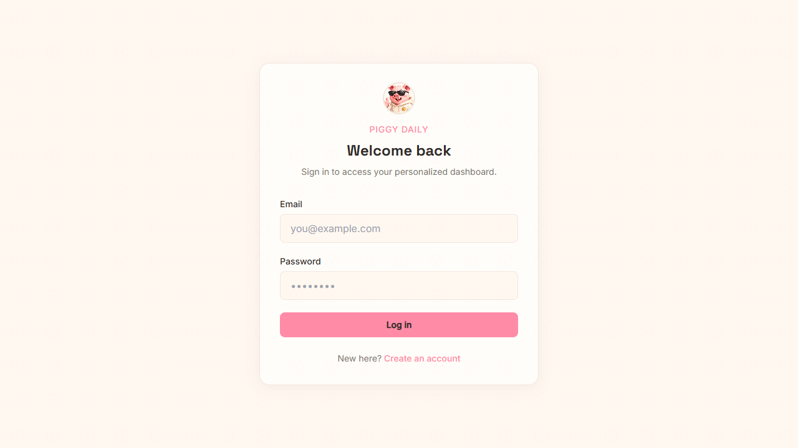
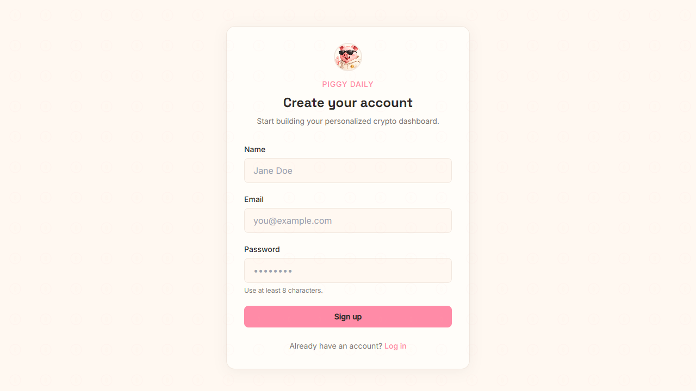
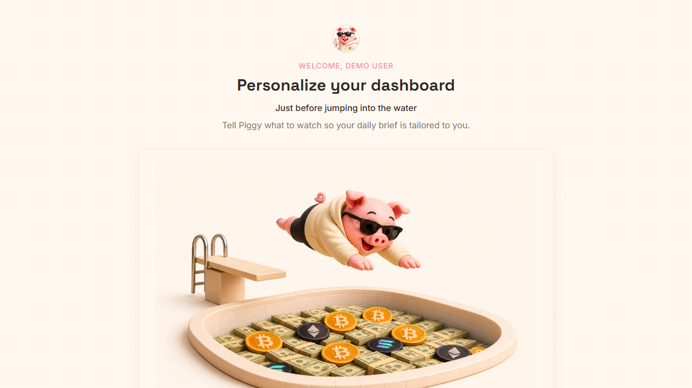
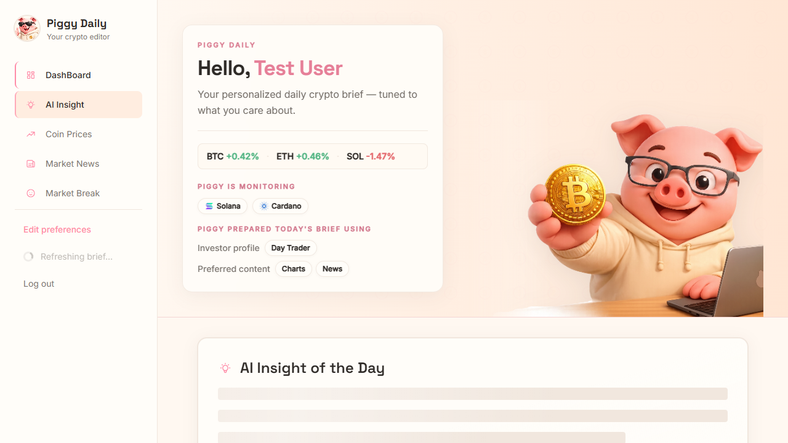
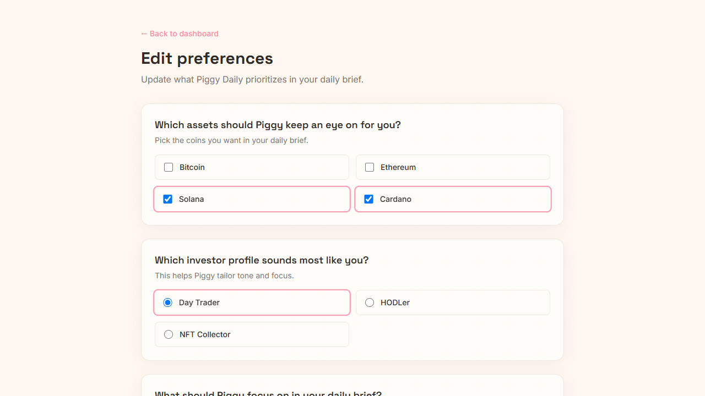
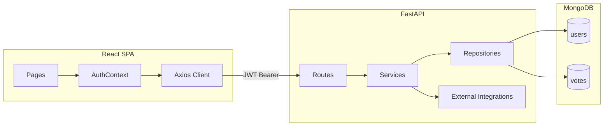

<p align="center">
  
</p>

<h1 align="center">🐷 Piggy Daily — AI Crypto Advisor</h1>

<p align="center">
  <strong>A personalized daily crypto brief — built for clarity, not chaos.</strong><br/>
  Full-Stack Web Assignment · React · FastAPI · MongoDB
</p>

<p align="center">
  <a href="#live-demo">Live Demo</a> ·
  <a href="#the-idea">The Idea</a> ·
  <a href="#screenshots">Screenshots</a> ·
  <a href="#getting-started">Getting Started</a> ·
  <a href="#tech-stack--apis">Tech Stack</a>
</p>

---

## The Idea

Most crypto dashboards overwhelm you with tickers, charts, and jargon before you even know what you care about. **Piggy Daily** takes the opposite approach: it asks who you are as an investor first, then delivers a focused daily brief shaped around your answers.

After a short onboarding quiz, the app learns your preferred assets, investing style, and content interests — and uses that profile to personalize prices, AI insights, and the order of your dashboard sections. One refresh loads everything in parallel: news, prices, an AI summary, and a lighthearted meme to close the loop.

### Why a pig?

The piggy bank is one of the first symbols most people associate with saving and building something over time. Crypto tools often feel cold, aggressive, or intimidating — Piggy is the friendly counterweight. He is your daily analyst companion: warm, approachable, and honest about what he knows (and what he does not).

The visual language follows that same philosophy — **young, simple, and clear**:

| Design choice | Intent |
|---------------|--------|
| Soft pink, peach, and cream palette | Feels welcoming rather than "trading-floor intense" |
| Rounded cards and generous whitespace | Reduces visual noise; each section stands on its own |
| Piggy as a recurring guide | Creates emotional continuity from onboarding through the daily brief |
| Four fixed sections, no bloat | High-signal content only — insight, news, prices, fun |

Piggy is not a gimmick layered on top of a generic dashboard. He is the product voice: *"Tell me what you care about, and I will prepare your brief."*

---

## User Flow


Returning users skip onboarding and land directly on the dashboard. Preferences can be updated at any time from Settings.

---

## Live Demo

| Service | URL |
|---------|-----|
| **Frontend (Vercel)** | `https://YOUR-APP.vercel.app` *(set in Vercel after deploy)* |
| **Backend API (Render)** | `https://crypto-ai-dashboard-1f6g.onrender.com` |
| **API Docs (Swagger)** | `https://crypto-ai-dashboard-1f6g.onrender.com/docs` |

---

## Screenshots

Every page in the application, captured at 1280×800.

### Login

<p align="center">
  
</p>

Sign in to access your personalized dashboard. Clean auth layout with session-expiry handling.

---

### Sign Up

<p align="center">
  
</p>

Create an account with name, email, and password (minimum 8 characters). Redirects to login on success.

---

### Onboarding

<p align="center">
  
</p>

Three-step preference quiz — assets, investor profile, and content focus. Required before the first dashboard visit.

| Step | Field | Options |
|------|-------|---------|
| 1 | Assets to track | Bitcoin · Ethereum · Solana · Cardano |
| 2 | Investor profile | HODLer · Day Trader · NFT Collector |
| 3 | Content focus | Market News · Charts · Social · Fun |

---

### Dashboard

<p align="center">
  
</p>

The daily brief — four sections refreshed in parallel via **Refresh Brief**:

| Section | Source | Personalization |
|---------|--------|-----------------|
| **AI Insight of the Day** | OpenRouter | Tailored to assets, investor type, and content preferences |
| **Market News** | CCData / CryptoCompare | Top 5 industry articles |
| **Coin Prices** | CoinGecko | Live prices, 24h change, volume, and 7-day sparklines |
| **Market Break** | meme-api.com | Random crypto meme — rotates on every refresh |

Section order adapts on the client based on content-type preferences (e.g., *Charts* prioritizes prices).

---

### Settings

<p align="center">
  
</p>

Update assets, investor profile, and content focus at any time. Changes apply to future briefs immediately.

---

## Key Features

### Authentication and onboarding

- JWT-based auth with bcrypt password hashing
- Protected routes enforce onboarding completion before dashboard access
- Preferences persisted in MongoDB and editable from Settings

### Feedback and voting

Every dashboard section includes reusable **Helpful / Not helpful** controls. Votes are sent to `POST /api/votes` with:

- `user_id`, `section`, `item_reference`, `vote_value` (+1 / −1)
- A rich `content_snapshot` (insight excerpt, news article IDs, coin prices, meme metadata)

A unique MongoDB compound index and upsert logic prevent duplicate votes per user per content item.

---

## Tech Stack & APIs

### Frontend

| Tool | Version | Role |
|------|---------|------|
| [React](https://react.dev/) | 19 | UI framework |
| [Vite](https://vite.dev/) | 8 | Build tool and dev server |
| [React Router](https://reactrouter.com/) | 7 | Client-side routing |
| [Axios](https://axios-http.com/) | 1.7 | HTTP client with JWT interceptors |
| [Tailwind CSS](https://tailwindcss.com/) | 3 | Utility-first styling |

### Backend

| Tool | Role |
|------|------|
| [FastAPI](https://fastapi.tiangolo.com/) | Async REST API framework |
| [Uvicorn](https://www.uvicorn.org/) | ASGI server |
| [Motor](https://motor.readthedocs.io/) | Async MongoDB driver |
| [Pydantic v2](https://docs.pydantic.dev/) | Validation and settings |
| [PyJWT](https://pyjwt.readthedocs.io/) | JWT token creation and verification |
| [Passlib + bcrypt](https://passlib.readthedocs.io/) | Password hashing |
| [httpx](https://www.python-httpx.org/) | Async HTTP client for external APIs |
| [SlowAPI](https://github.com/laurentS/slowapi) | Rate limiting on auth endpoints |
| [pytest](https://docs.pytest.org/) | Backend test suite |

### Database

**MongoDB** — two collections: `users` (accounts and preferences) and `votes` (feedback with content snapshots).

### External APIs

| API | Purpose | Auth required |
|-----|---------|---------------|
| [CoinGecko](https://www.coingecko.com/en/api) | Live coin prices and 7-day sparklines | No |
| [CCData / CryptoCompare](https://min-api.cryptocompare.com/) | Market news feed | Optional `CCDATA_API_KEY` |
| [OpenRouter](https://openrouter.ai/) | Daily AI insight generation | `OPENROUTER_API_KEY` |
| [meme-api.com](https://meme-api.com/) | Random crypto memes from Reddit | No |

All third-party API keys are stored server-side. The frontend never exposes secrets.

---

## Architecture Highlights



### Best practices implemented

- **JWT authentication** — tokens issued at login; protected routes validated via `get_current_user`; 401 responses clear the client session automatically
- **Layered backend** — routes → services → repositories under `backend/app/`
- **Robust API fallbacks** — graceful degradation when external services fail:
  - News → curated 5-article static fallback
  - AI Insight → locally simulated, preference-aware insight when OpenRouter is unavailable
  - Meme → static image fallback
  - Prices → empty state (no fake data injected)
- **Rate limiting (SlowAPI)** — 10 requests/minute per IP on `POST /signup` and `POST /login`
- **Vote deduplication** — unique compound index on `(user_id, section, item_reference)` with MongoDB upsert

### API endpoints

| Method | Path | Auth | Description |
|--------|------|------|-------------|
| `POST` | `/signup` | — | Register a new user |
| `POST` | `/login` | — | Authenticate and receive JWT |
| `GET` | `/me` | JWT | Current user profile and preferences |
| `POST` | `/onboarding` | JWT | Complete onboarding quiz |
| `PATCH` | `/me/preferences` | JWT | Update preferences |
| `GET` | `/api/crypto/prices` | JWT | Coin prices for user's assets |
| `GET` | `/api/crypto/news` | JWT | Market news articles |
| `GET` | `/api/crypto/insight` | JWT | Personalized AI insight |
| `GET` | `/api/crypto/meme` | JWT | Random crypto meme |
| `POST` | `/api/votes` | JWT | Record or update feedback vote |

---

## Getting Started

### Prerequisites

- **Node.js** 18+
- **Python** 3.10+ (CI uses 3.12)
- **MongoDB** running locally (`mongodb://localhost:27017`) or a MongoDB Atlas URI

### Backend setup

```powershell
cd backend
python -m venv .venv
.\.venv\Scripts\Activate.ps1
pip install -r requirements.txt
copy .env.example .env
```

Edit `.env` — at minimum set `MONGODB_URI` and `JWT_SECRET_KEY` (at least 32 characters).

```powershell
uvicorn app.main:app --reload
```

API runs at **http://127.0.0.1:8000** · Swagger docs at **http://127.0.0.1:8000/docs**

**Optional — seed a test user:**

```powershell
python -m app.seed_db
```

Defaults: `test@example.com` / `password123`

### Frontend setup

```powershell
cd frontend
npm install
```

Create `frontend/.env`:

```env
VITE_API_BASE_URL=http://127.0.0.1:8000
```

```powershell
npm run dev
```

App runs at **http://localhost:5173**

### Running tests

```powershell
# Backend (from backend/)
pytest

# Frontend (from frontend/)
npm test
```

### Regenerating README screenshots

With both servers running locally:

```powershell
node scripts/capture-readme-screenshots.mjs
```

Requires Playwright Chromium (`npx playwright install chromium`).

---

## Environment Variables

### Backend (`backend/.env`)

Copy from [`backend/.env.example`](backend/.env.example):

| Variable | Required | Description |
|----------|----------|-------------|
| `MONGODB_URI` | **Yes** | MongoDB connection string |
| `MONGODB_DB_NAME` | No | Database name (default: `crypto_dashboard`) |
| `JWT_SECRET_KEY` | **Yes** | Secret key — minimum 32 characters |
| `JWT_ALGORITHM` | No | Token algorithm (default: `HS256`) |
| `ACCESS_TOKEN_EXPIRE_MINUTES` | No | Token lifetime in minutes (default: `1440`) |
| `CCDATA_API_KEY` | No | Optional CCData/CryptoCompare news API key |
| `OPENROUTER_API_KEY` | No | Enables live AI insights via OpenRouter |
| `OPENROUTER_MODEL` | No | LLM model ID (default: `meta-llama/llama-3-8b-instruct:free`) |
| `OPENROUTER_SITE_URL` | No | HTTP Referer sent to OpenRouter |
| `OPENROUTER_APP_NAME` | No | Application name sent to OpenRouter |
| `SEED_TEST_EMAIL` | No | Email for local seed script |
| `SEED_TEST_PASSWORD` | No | Password for local seed script |
| `CORS_ORIGINS` | **Yes (prod)** | Comma-separated allowed frontend origins (include Vercel URL) |

### Frontend (`frontend/.env`)

Copy from [`frontend/.env.example`](frontend/.env.example):

| Variable | Required | Description |
|----------|----------|-------------|
| `VITE_API_BASE_URL` | No | Backend API URL (default: `http://127.0.0.1:8000`) |

---

## Deployment

### Frontend (Vercel)

1. Import the GitHub repo and set **Root Directory** to `frontend`.
2. Framework preset: **Vite** — Build Command: `npm run build`, Output Directory: `dist`.
3. Add environment variable:
   ```env
   VITE_API_BASE_URL=https://crypto-ai-dashboard-1f6g.onrender.com
   ```
4. Deploy. [`frontend/vercel.json`](frontend/vercel.json) handles SPA routing for React Router.

### Backend (Render)

The API runs on Render. Ensure these environment variables are set:

- `MONGODB_URI`, `JWT_SECRET_KEY` (required)
- `CORS_ORIGINS` — must include your Vercel URL, for example:
  ```env
  CORS_ORIGINS=http://localhost:5173,http://127.0.0.1:5173,https://YOUR-APP.vercel.app
  ```
- Optional: `OPENROUTER_API_KEY`, `CCDATA_API_KEY`

After updating `CORS_ORIGINS`, redeploy the backend service.

---

## Project Structure

```
crypto-ai-dashboard/
├── backend/
│   ├── app/
│   │   ├── api/routes/       # FastAPI route handlers
│   │   ├── core/             # Config, security, rate limiter
│   │   ├── db/repositories/  # MongoDB data access
│   │   ├── schemas/          # Pydantic models
│   │   ├── services/         # Business logic
│   │   │   └── external/     # CoinGecko, CCData, OpenRouter, meme-api
│   │   ├── main.py           # App entry point
│   │   └── seed_db.py        # Local test user seeder
│   ├── tests/
│   └── requirements.txt
├── frontend/
│   ├── public/               # Piggy mascot assets
│   ├── src/
│   │   ├── pages/            # Login, Signup, Onboarding, Dashboard, Settings
│   │   ├── components/       # UI, layout, dashboard sections
│   │   └── config/           # Personalization and section config
│   └── package.json
├── docs/
│   ├── assets/               # README mascot image
│   |__ readme-screenshots/   # Page screenshots for this README
│   
└── scripts/
    └── capture-readme-screenshots.mjs
```

---

## Additional Documentation

- **[HR Project Summary](docs/HR_PROJECT_SUMMARY.md)** — concise 1-page overview for submission
- **[UI Audit Report](docs/ui-audit-report.md)** — accessibility and UX audit findings
- **[Design Spec](frontend/DESIGN_SPEC.md)** — component and integration reference

---

## AI Usage

This project was developed with the assistance of AI-powered tools, including **Cursor** , gemini for:

- Boilerplate code generation (route handlers, React components, Pydantic schemas)
- Debugging and troubleshooting integration issues
- Code structuring and architectural suggestions
- Documentation drafting (this README, project summary)

All architecture decisions, external API integration logic, authentication flows, and final code were **reviewed, tested, and validated by the author**. AI tools were used as a productivity aid — not as a substitute for understanding the implementation.
