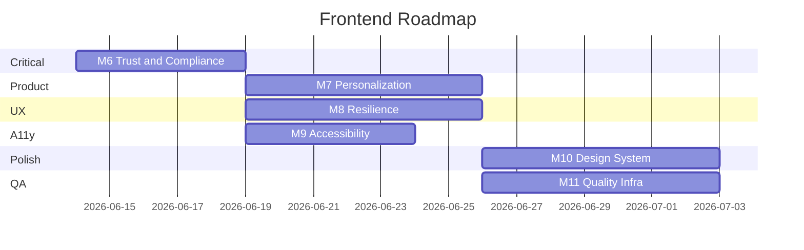

# Frontend Roadmap — Piggy Daily

**Last updated:** June 13, 2026  
**Scope:** Post-audit implementation plan for `frontend/`  
**Total open issues:** 31 (0 Critical, 7 High, 14 Medium, 10 Low)  
**Current milestone:** M8 — Resilience & Feedback

---

## Vision

Deliver a trustworthy, accessible, personalized crypto dashboard that fulfills all product requirements — including vote metadata, preference-driven content, and resilient auth — while hardening the design system for maintainability.

---

## Milestones Overview

| Milestone | Name | Focus | Issues | Target |
|-----------|------|-------|--------|--------|
| M6 | Trust & Compliance | Auth sync, vote snapshots, session UX | AUTH-01–03, VOTE-01, VOTE-04 | Week 1 | **✅ Complete** |
| M7 | Personalization | content_types tailoring, preferences editing | UX-02, UX-03 | Week 2 | **✅ Complete** |
| M8 | Resilience & Feedback | Stale data, retry, load failures, vote hydration | UX-01, UX-07, UX-08, VOTE-02, VOTE-03 | Week 2–3 |
| M9 | Accessibility Hardening | Forms, drawer, progress, groups | A11Y-01–09 | Week 3 |
| M10 | Design System & Polish | Tokens, components, visual consistency | UI-01–06, ARCH-02–04, DS items | Week 4 |
| M11 | Quality Infrastructure | E2E CI, component tests, lint | ARCH-09, ARCH-10, ARCH-07 | Week 4+ |

---

## M6 — Trust & Compliance (Critical Path) ✅ Complete

**Completed:** June 13, 2026 (TASK-101 – TASK-105)

**Goal:** Fix auth/vote gaps that block product acceptance and erode user trust.

### Deliverables
1. Unified auth logout on 401 with login redirect and session-expired message
2. Rollback orphan tokens when `/me` fails after login
3. `content_snapshot` sent with every vote from all four dashboard sections
4. Disable voting on empty/error placeholder content

### Success Criteria
- Expired session redirects to login with visible message within one navigation
- Vote POST payload includes non-empty `content_snapshot` for each section type
- No votes recorded against `"*-empty"` synthetic IDs

### Issues
| ID | Title | Severity | Effort |
|----|-------|----------|--------|
| AUTH-01 | Auth context desyncs after 401 | Critical | S |
| VOTE-01 | Missing content_snapshot | Critical | M |
| AUTH-02 | Orphan token on failed /me | High | S |
| AUTH-03 | No session-expired feedback | High | S |
| VOTE-04 | Feedback on empty/error placeholders | Medium | S |

### Dependencies
- None for auth fixes
- VOTE-01 requires snapshot builder design per section (see design-system-improvements.md)

---

## M7 — Personalization (Product Gap) ✅ Complete

**Completed:** June 13, 2026 (TASK-201 – TASK-204)

**Goal:** Make onboarding preferences visibly affect the dashboard.

### Deliverables
1. Section visibility/order driven by `content_types` preferences
2. Backend insight prompt includes `content_types` (coordination with backend)
3. Settings route or edit-preferences entry point

### Proposed content_types → section mapping

| Preference | Primary Section | Behavior |
|------------|-----------------|----------|
| Market News | Market News | Promote to top if selected |
| Charts | Coin Prices | Expand by default if selected |
| Social | Market News | Filter social-tagged articles (future) |
| Fun | Fun Crypto Meme | Promote meme section |

### Success Criteria
- User who selects only "Charts" and "Fun" sees those sections prioritized
- Preferences editable after onboarding without re-signup
- `PreferencesSummary` reflects live preferences post-edit

### Issues
| ID | Title | Severity | Effort |
|----|-------|----------|--------|
| UX-02 | content_types not used | High | L |
| UX-03 | No preferences editing | High | M |

### Dependencies
- Product sign-off on mapping
- Backend: PATCH `/me/preferences` or re-use POST `/onboarding` in edit mode

---

## M8 — Resilience & Feedback

**Goal:** Improve error recovery and feedback persistence.

### Deliverables
1. Stale-data labeling or clearing on refresh failure
2. Per-section retry in `useDashboardData`
3. Global banner when all sections fail on initial load
4. Vote hydration from GET endpoint
5. Stable insight vote keys (date hash or backend ID)

### Success Criteria
- Retry on news error does not re-fetch prices/meme/insight
- Refresh failure shows "Data may be outdated" when stale content retained
- Returning user sees prior vote selection on unchanged content

### Issues
| ID | Title | Severity | Effort |
|----|-------|----------|--------|
| UX-01 | Stale data after refresh failure | High | M |
| UX-07 | Full-dashboard retry only | Medium | M |
| UX-08 | No initial load failure toast | Medium | S |
| VOTE-02 | No vote hydration | High | M |
| VOTE-03 | Weak insight vote key | Medium | S |

### Dependencies
- VOTE-02 requires backend `GET /api/votes`
- VOTE-03 may require backend insight ID

---

## M9 — Accessibility Hardening

**Goal:** Close WCAG gaps identified in audit.

### Deliverables
1. FormField with `aria-describedby` / `aria-invalid`
2. Mobile menu `aria-expanded` + main `inert`
3. Onboarding fieldsets and progressbar semantics
4. Loading/submit busy states
5. Dismissible toasts

### Success Criteria
- axe-core scan: zero critical/serious violations on login, onboarding, dashboard
- Keyboard-only user can complete full flow without focus traps behind drawer

### Issues
| ID | Title | Severity | Effort |
|----|-------|----------|--------|
| A11Y-01 | Form errors not linked | High | S |
| A11Y-02 | Menu aria-expanded | Medium | S |
| A11Y-03 | Main not inert | Medium | S |
| A11Y-04 | Progressbar semantics | Medium | S |
| A11Y-05 | Missing fieldsets | Medium | S |
| A11Y-06 | Feedback group label | Low | S |
| A11Y-07 | Loading not announced | Low | S |
| A11Y-08 | Submit aria-busy | Low | S |
| A11Y-09 | Toast not dismissible | Low | S |

### Dependencies
- M6 auth redirect should include accessible session message

---

## M10 — Design System & Visual Polish

**Goal:** Standardize tokens and extract remaining duplicate patterns.

### Deliverables
1. Typography scale tokens and `PageTitle` / `Overline` components
2. Unified `rounded-card` usage
3. `Panel`, `BrandHeader`, `statusVariants` extraction
4. AI insight mobile layout fix
5. Onboarding UX polish (progress, validation)

### Success Criteria
- All page titles use consistent scale
- Zero `rounded-xl` on top-level cards (nested tiles may use `rounded-lg`)
- Alert/Toast/StateMessage share variant map

### Issues
| ID | Title | Severity | Effort |
|----|-------|----------|--------|
| UI-01 | Auth title size | Medium | S |
| UI-02 | Border radius inconsistency | Medium | S |
| UI-03 | Overline variants | Low | S |
| UI-04 | Insight mobile layout | Medium | S |
| UI-05 | Duplicate error+empty | Medium | S |
| UI-06 | Refresh disabled on load | Low | S |
| UX-04 | Scroll-based progress | Medium | M |
| UX-05 | Validation on submit only | Medium | M |
| UX-06 | Post-signup success | Medium | S |
| UX-09 | Root redirect hop | Low | S |
| UX-10 | No 404 page | Low | S |
| ARCH-01 | Duplicate spinners | Low | S |
| ARCH-02 | Status banner duplication | Medium | S |
| ARCH-03 | Inline SelectionCard | Low | S |
| ARCH-04 | Brand header duplication | Low | S |
| ARCH-05 | API port mismatch | Medium | S |
| ARCH-07 | Unused imports | Low | S |
| ARCH-08 | Unused danger variant | Low | S |

### Dependencies
- See [design-system-improvements.md](design-system-improvements.md)

---

## M11 — Quality Infrastructure

**Goal:** Prevent regressions through automation.

### Deliverables
1. Playwright in package.json + CI workflow
2. Vitest + RTL for SectionCard, AuthContext, useDashboardData
3. ESLint + Prettier configuration

### Success Criteria
- CI runs unit tests + e2e smoke on PR
- Critical component states have test coverage

### Issues
| ID | Title | Severity | Effort |
|----|-------|----------|--------|
| ARCH-09 | E2E not in CI | Medium | M |
| ARCH-10 | No UI tests | Low | L |
| ARCH-06 | No data-fetching library | Low | L (defer) |

---

## Suggested Implementation Order

### Week-by-week plan

| Week | Focus | Key tasks |
|------|-------|-----------|
| 1 | M6 | AUTH-01, AUTH-02, AUTH-03, VOTE-01, VOTE-04 |
| 2 | M7 + M8 start | UX-02 mapping, UX-03 settings route, UX-01 stale data |
| 3 | M8 + M9 | VOTE-02 hydration, UX-07 per-section retry, A11Y-01–05 |
| 4 | M10 + M11 | Design tokens, component extraction, Playwright CI |

---

## Risk Register

| Risk | Likelihood | Impact | Mitigation |
|------|------------|--------|------------|
| Backend changes needed for votes GET | Medium | Blocks VOTE-02 | Parallel backend task in M8 |
| content_types mapping ambiguous | Medium | Delays M7 | Product workshop early in M7 |
| Personalization scope creep | High | Delays M7 | Start with section reorder only |
| Auth refactor breaks guards | Low | High | Add e2e smoke before M6 |

---

## Out of Scope (Current Phase)

- TypeScript migration
- React Query adoption
- Dark mode
- Internationalization
- PWA/offline support
- Paid API integrations

---

## Related Documents

- [UI Audit Report](ui-audit-report.md) — full issue register
- [Task Backlog](task-backlog.md) — actionable tasks with acceptance criteria
- [Design System Improvements](design-system-improvements.md) — component and token spec
