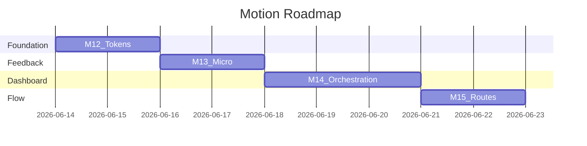

# Motion Roadmap — Piggy Daily

**Last updated:** June 13, 2026  
**Scope:** Motion, interaction, and engagement polish  
**Prerequisite:** M6–M7 complete (trust + personalization)

---

## Vision

Transform Piggy Daily from a functional dashboard into a **premium, modern SaaS experience** — subtle motion, clear feedback, guided attention — without gimmicks or bundle bloat.

Reference quality bar: Linear, Stripe, Notion, Vercel (subtle, fast, purposeful).

---

## Milestones

| Milestone | Name | Focus | Tasks | Status |
|-----------|------|-------|-------|--------|
| M12 | Motion Foundation | Tokens, utilities, RM hook | MOT-TASK-001–004 | ✅ Complete |
| M13 | Feedback Layer | Buttons, toasts, alerts, forms, votes | MOT-TASK-010–016 | ✅ Complete |
| M14 | Dashboard Orchestration | Stagger, refresh, collapse, prices | MOT-TASK-030–035 | ✅ Complete |
| M15 | Flow & Delight | Routes, onboarding moment, loading | MOT-TASK-020–023 | ✅ Complete |

---

## M12 — Motion Foundation

**Goal:** Single source of truth for duration, easing, and reusable motion utilities.

### Deliverables
1. CSS motion variables in `:root`
2. Tailwind `transitionDuration`, `transitionTimingFunction`, `keyframes`, `animation` extensions
3. Component utility classes: `motion-interactive`, `motion-card`, `motion-press`, `motion-shimmer`, `motion-fade-in`, `motion-slide-up`
4. `usePrefersReducedMotion()` hook for JS-gated animation

### Success Criteria
- All new motion uses tokens (no magic `duration-300` in new code)
- RM users see instant state changes
- Zero bundle size increase

---

## M13 — Feedback Layer

**Goal:** Every primary user action receives visible feedback within 200ms.

### Deliverables
1. Toast slide-up enter / fade exit
2. Alert fade-in entrance
3. Button press + interactive hover bundle
4. Selection card snappy check transition
5. Vote thumb scale + success message animation
6. LazyImage opacity fade
7. Shimmer skeleton upgrade

### Success Criteria
- Login, signup, vote, refresh all feel responsive
- No layout shift from motion (CLS stable)

---

## M14 — Dashboard Orchestration

**Goal:** Dashboard feels alive, hierarchical, and trustworthy on data updates.

### Deliverables
1. Section stagger on mount (60ms steps)
2. Refresh overlay fade (150ms)
3. Section collapse preview crossfade
4. News list item stagger
5. Price tile hover lift + value flash on refresh
6. Sparkline stroke draw (optional, RM-off)
7. Sidebar nav transition + backdrop fade
8. StateMessage fade-in

### Success Criteria
- First paint guides eye to AI Insight
- Refresh feels like update, not reload
- Price changes are noticeable without being distracting

---

## M15 — Flow & Delight

**Goal:** Continuity across routes and milestone moments.

### Deliverables
1. CSS View Transitions API on route changes (zero bundle)
2. Onboarding success overlay before dashboard navigate
3. Branded loading screen with staggered entrance
4. Signup success alert on login page

### Library Decision
- **Default:** CSS View Transitions + CSS animations only
- **Do NOT add** Framer Motion / Motion One unless View Transitions prove insufficient
- **Gate:** If stagger/page orchestration needs JS library, add `motion` (~25kb gzip) at App.jsx outlet only — not for buttons/cards

### Success Criteria
- Auth → onboarding → dashboard feels like one product
- Onboarding completion has a brief celebratory pause
- Loading screen reinforces Piggy brand

---

## Implementation Order

---

## What We Will NOT Do

- Bouncing logos, parallax, particles
- Animating every element
- Motion libraries for CSS-solvable problems
- Delays >500ms on critical paths
- Disabling focus rings or skip links

---

## Success Metrics

| Metric | Target |
|--------|--------|
| Bundle increase (M12–M14) | 0 kb |
| Primary action feedback latency | ≤200ms visual response |
| RM compliance | Instant functional UI |
| Build/tests | Pass after each batch |
| CLS | No regression from motion |

---

## Relationship to Existing Roadmap

Runs parallel to M8–M11 ([frontend-roadmap.md](frontend-roadmap.md)). Motion tokens (M12) should be merged into [design-system-improvements.md](design-system-improvements.md) as the motion layer.

---

## Related Documents

- [Motion Audit Report](motion-audit.md)
- [Motion Task Backlog](motion-task-backlog.md)
