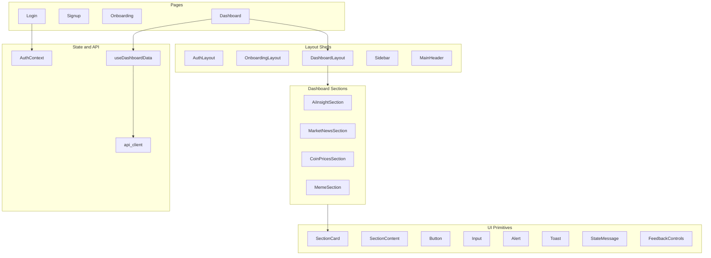

# UI Audit Report — Piggy Daily

**Audit date:** June 13, 2026  
**Application:** React 19 + Vite 6 + Tailwind CSS 3.4 SPA (`frontend/src`, 58 source files)  
**Methods:** Full static code review across pages, layouts, sections, UI primitives, hooks, API layer, and routing; cross-reference with product rules and backend contracts  
**Auditor roles:** Senior Frontend Architect, UX Auditor, QA Engineer, Product Manager

---

## Executive Summary

Piggy Daily is a lean, well-organized SPA with clear separation between pages, layout shells, dashboard sections, UI primitives, hooks, and a thin API layer. The Piggy design language is cohesive across auth, onboarding, and dashboard. Core user flows (signup → login → onboarding → dashboard) are implemented with loading, empty, and error states at the section level.

**Strengths:** Shared `SectionCard` pattern, parallel dashboard fetching via `useDashboardData`, extracted `useScrollSpy` and `resolvePostAuthPath`, reusable form primitives (`FormField`, `Input`, `Button`), skip link, mobile focus trap, and table accessibility in coin prices.

**Primary gaps:** Auth state can desync after 401 responses; vote metadata (`content_snapshot`) is not sent despite product requirements; personalization stops at asset/investor-type on the backend with no frontend tailoring by `content_types`; several accessibility and feedback-state gaps remain; design tokens cover color but not typography or spacing scales.

| Severity | Count |
|----------|-------|
| Critical | 2 |
| High | 9 |
| Medium | 14 |
| Low | 11 |
| **Total** | **36** |

---

## Screens Inventory

| Screen | Route | Key Components | Modals/Dialogs |
|--------|-------|----------------|----------------|
| Login | `/login` | `AuthLayout`, `FormField`, `Input`, `Button`, `Alert` | None |
| Signup | `/signup` | Same as login | None |
| Onboarding | `/onboarding` | `OnboardingLayout`, `OnboardingProgress`, `SelectionCard` (inline), `CheckboxCard`, `RadioCard` | None |
| Dashboard | `/dashboard` | `DashboardLayout`, `Sidebar`, `MainHeader`, 4 section components, `Toast` | Mobile sidebar overlay (drawer) |
| Auth bootstrap | Any protected route | `LoadingScreen` (`ProtectedRoute`) | None |
| Catch-all | `*` | `NotFoundRedirect` → auth-aware redirect | None |

**Not present:** Settings/profile, preferences editing, dedicated 404 page, confirmation dialogs, data tables beyond mini price table, modals.

**Responsive breakpoints observed in code:** `sm` (640px), `md` (768px), `lg` (1024px). Primary layouts tested in prior audit at 375px, 768px, 1280px. See [`audit-screenshots/post-fix/`](audit-screenshots/post-fix/) for historical captures.

---

## Architecture Overview

---

## Issue Register

Each issue includes: Title, Severity, Location, Description, Business Impact, Recommended Solution, Estimated Effort, Dependencies.

Format: **Complexity** = Small | Medium | Large · **Impact** = qualitative user/business effect.

---

### AUTH-01 — Auth Context Desyncs After 401

| Field | Value |
|-------|-------|
| **Severity** | Critical |
| **Location** | `frontend/src/api/client.js` (L33–36), `frontend/src/context/AuthContext.jsx` |
| **Description** | Axios response interceptor clears `localStorage` on 401 but does not update React auth state. `isAuthenticated` remains `true` while subsequent requests have no token. |
| **Business Impact** | Users appear logged in but dashboard data and votes fail silently until manual refresh; erodes trust and causes support confusion. |
| **Recommended Solution** | Emit auth-expired event or call `clearSession()` from context; redirect to `/login` with "Session expired" message. |
| **Estimated Effort** | Small |
| **Dependencies** | None |
| **Complexity** | Small · **Impact** | High |

---

### VOTE-01 — Vote Payload Missing content_snapshot

| Field | Value |
|-------|-------|
| **Severity** | Critical |
| **Location** | `frontend/src/components/ui/FeedbackControls.jsx` (L68–72), `frontend/src/api/votes.js` |
| **Description** | Product rules require persisting vote context metadata. Backend schema accepts `content_snapshot` (`backend/app/schemas/vote.py`) but frontend never sends it. |
| **Business Impact** | Feedback data is unusable for future recommendation improvements; fails assignment acceptance criteria. |
| **Recommended Solution** | Pass section-specific snapshot (title, URL, price summary, insight excerpt) from each section into `FeedbackControls`; include in POST body. |
| **Estimated Effort** | Medium |
| **Dependencies** | Section components must expose snapshot builders |
| **Complexity** | Medium · **Impact** | High |

---

### AUTH-02 — Orphan Token When /me Fails After Login

| Field | Value |
|-------|-------|
| **Severity** | High |
| **Location** | `frontend/src/context/AuthContext.jsx` (L72–77) |
| **Description** | Token is persisted to `localStorage` and React state before `fetchCurrentUser()` completes. If `/me` fails, login shows error but stale token remains until bootstrap clears it. |
| **Business Impact** | Intermittent auth failures leave users in ambiguous half-authenticated state. |
| **Recommended Solution** | Only persist token after successful `/me`; rollback on failure in `login()`. |
| **Estimated Effort** | Small |
| **Dependencies** | None |
| **Complexity** | Small · **Impact** | Medium |

---

### AUTH-03 — No Session-Expired User Feedback

| Field | Value |
|-------|-------|
| **Severity** | High |
| **Location** | `frontend/src/api/client.js`, `frontend/src/pages/Login.jsx` |
| **Description** | When session expires (401), storage is cleared with no user-facing message. Login page does not surface "Your session expired" via query param or location state. |
| **Business Impact** | Users don't understand why dashboard suddenly stopped working. |
| **Recommended Solution** | On 401, navigate to `/login?reason=session_expired` and show info `Alert`. |
| **Estimated Effort** | Small |
| **Dependencies** | AUTH-01 |
| **Complexity** | Small · **Impact** | Medium |

---

### UX-01 — Stale Data Shown After Refresh Failure

| Field | Value |
|-------|-------|
| **Severity** | High |
| **Location** | `frontend/src/hooks/useDashboardData.js` (L103–108) |
| **Description** | On refresh error, previous section data is intentionally retained while error banner displays. Users may see outdated prices/news alongside error state. |
| **Business Impact** | Misleading financial information during API outages; compliance and trust risk for a crypto dashboard. |
| **Recommended Solution** | Label stale data ("Last updated … may be outdated") or clear section data on refresh failure; distinguish initial vs refresh error UX. |
| **Estimated Effort** | Medium |
| **Dependencies** | None |
| **Complexity** | Medium · **Impact** | High |

---

### UX-02 — content_types Preferences Not Used for Personalization

| Field | Value |
|-------|-------|
| **Severity** | High |
| **Location** | `frontend/src/pages/Dashboard.jsx`, `backend/app/api/routes/dashboard.py` |
| **Description** | Onboarding collects `content_types` (Market News, Charts, Social, Fun) but all four dashboard sections always render. Backend insight uses `investor_type` and `assets` only; `content_types` appear only in `PreferencesSummary`. |
| **Business Impact** | Core product promise ("tailored daily dashboard") is partially unfulfilled; onboarding question feels pointless. |
| **Recommended Solution** | Hide/reorder/prioritize sections based on preferences; pass `content_types` to insight generation; highlight preferred content in section ordering. |
| **Estimated Effort** | Large |
| **Dependencies** | Product decision on mapping content types → sections |
| **Complexity** | Large · **Impact** | High |

---

### UX-03 — No Post-Onboarding Preferences Editing

| Field | Value |
|-------|-------|
| **Severity** | High |
| **Location** | `frontend/src/App.jsx` (routes), `frontend/src/pages/Onboarding.jsx` |
| **Description** | Preferences are write-once. Completed users redirected away from `/onboarding`. No settings route exists. |
| **Business Impact** | Users cannot update interests; increases churn for evolving investors. |
| **Recommended Solution** | Add `/settings` or re-entry to onboarding in edit mode from dashboard header. |
| **Estimated Effort** | Medium |
| **Dependencies** | Backend may need PATCH preferences endpoint |
| **Complexity** | Medium · **Impact** | Medium |

---

### UX-04 — Onboarding Progress Is Scroll-Based, Not Completion-Based

| Field | Value |
|-------|-------|
| **Severity** | Medium |
| **Location** | `frontend/src/pages/Onboarding.jsx` (L44–50), `frontend/src/components/ui/OnboardingProgress.jsx` |
| **Description** | Step indicator advances when user scrolls into a section, not when selections are valid. User can appear on step 3 while step 1 is empty. |
| **Business Impact** | Misleading progress feedback; users think they're further along than they are. |
| **Recommended Solution** | Derive `currentStep` from completion state (assets selected → step 2, etc.) or use explicit step wizard with Continue gates. |
| **Estimated Effort** | Medium |
| **Dependencies** | None |
| **Complexity** | Medium · **Impact** | Medium |

---

### UX-05 — Onboarding Validation Only on Final Submit

| Field | Value |
|-------|-------|
| **Severity** | Medium |
| **Location** | `frontend/src/pages/Onboarding.jsx` (L58–73) |
| **Description** | Validation errors appear in top `Alert` after clicking submit. Long scrollable form may hide errors below fold; no scroll-to-error or field-level messages. |
| **Business Impact** | Users submit repeatedly without understanding what's missing. |
| **Recommended Solution** | Inline field errors via `FormField.error`; scroll to first invalid section; disable submit until valid (optional). |
| **Estimated Effort** | Medium |
| **Dependencies** | DS-03 (fieldset grouping) |
| **Complexity** | Medium · **Impact** | Medium |

---

### UX-06 — No Post-Signup Success Feedback

| Field | Value |
|-------|-------|
| **Severity** | Medium |
| **Location** | `frontend/src/pages/Signup.jsx` (L28–29), `frontend/src/pages/Login.jsx` (L18) |
| **Description** | After signup, user redirects to login with email pre-filled but no success banner ("Account created — log in"). |
| **Business Impact** | Users uncertain whether signup succeeded. |
| **Recommended Solution** | Pass `state: { email, signupSuccess: true }` and render success `Alert` on login. |
| **Estimated Effort** | Small |
| **Dependencies** | None |
| **Complexity** | Small · **Impact** | Low |

---

### UX-07 — Retry Reloads Entire Dashboard, Not Failed Section

| Field | Value |
|-------|-------|
| **Severity** | Medium |
| **Location** | `frontend/src/components/ui/SectionCard.jsx` (L151), all section components |
| **Description** | Per-section error UI offers retry but always calls `loadDashboard`, refreshing all four sections. |
| **Business Impact** | Unnecessary API load; meme rotates on unrelated section retry; slower recovery. |
| **Recommended Solution** | Add `retrySection(key)` to `useDashboardData` that fetches a single section. |
| **Estimated Effort** | Medium |
| **Dependencies** | None |
| **Complexity** | Medium · **Impact** | Medium |

---

### UX-08 — No Global Feedback on Initial Load Failure

| Field | Value |
|-------|-------|
| **Severity** | Medium |
| **Location** | `frontend/src/hooks/useDashboardData.js` (L119–131) |
| **Description** | Toast notifications only fire on refresh, not first load. If all sections fail on first visit, user sees four error cards with no page-level summary. |
| **Business Impact** | First impression is confusing; users may think app is broken without actionable guidance. |
| **Recommended Solution** | Show page-level banner or error toast when `failureCount === sectionCount` on initial load. |
| **Estimated Effort** | Small |
| **Dependencies** | None |
| **Complexity** | Small · **Impact** | Medium |

---

### UX-09 — Root Route Causes Extra Redirect Hop

| Field | Value |
|-------|-------|
| **Severity** | Low |
| **Location** | `frontend/src/App.jsx` (L15), `frontend/src/components/ProtectedRoute.jsx` |
| **Description** | `/` always navigates to `/dashboard`; unauthenticated users bounce `/` → `/dashboard` → `/login`. |
| **Business Impact** | Minor flash of loading/redirect on cold start. |
| **Recommended Solution** | Use auth-aware root redirect via `resolvePostAuthPath` or landing component. |
| **Estimated Effort** | Small |
| **Dependencies** | None |
| **Complexity** | Small · **Impact** | Low |

---

### UX-10 — No Dedicated 404 Page

| Field | Value |
|-------|-------|
| **Severity** | Low |
| **Location** | `frontend/src/components/NotFoundRedirect.jsx` |
| **Description** | Unknown paths silently redirect to login/onboarding/dashboard based on auth. No "Page not found" message or return link. |
| **Business Impact** | Broken bookmarks/deep links confuse users; no explanation of what happened. |
| **Recommended Solution** | Add `NotFound.jsx` with friendly copy and navigation CTAs; preserve intended URL for post-login redirect (optional). |
| **Estimated Effort** | Small |
| **Dependencies** | None |
| **Complexity** | Small · **Impact** | Low |

---

### VOTE-02 — Prior Votes Not Hydrated from Server

| Field | Value |
|-------|-------|
| **Severity** | High |
| **Location** | `frontend/src/components/ui/FeedbackControls.jsx` (L39–48) |
| **Description** | Vote UI resets on `itemReference` change but never loads existing votes. Backend has upsert but no GET votes endpoint exposed to frontend. |
| **Business Impact** | Users cannot see prior feedback; re-voting works but feels stateless; duplicate prevention is invisible. |
| **Recommended Solution** | Add `GET /api/votes?section=&item_reference=` backend route; hydrate `selectedVote` on mount. |
| **Estimated Effort** | Medium |
| **Dependencies** | Backend API addition |
| **Complexity** | Medium · **Impact** | Medium |

---

### VOTE-03 — Weak Insight Vote Identity Key

| Field | Value |
|-------|-------|
| **Severity** | Medium |
| **Location** | `frontend/src/hooks/useDashboardData.js` (L149) |
| **Description** | Insight `itemReference` uses `insight?.source || "insight-empty"`. Refreshed insights from same source share one vote key, overwriting prior feedback context. |
| **Business Impact** | Vote history conflates distinct daily insights; recommendation data quality degrades. |
| **Recommended Solution** | Use content hash, date stamp, or backend-generated insight ID as `item_reference`. |
| **Estimated Effort** | Small |
| **Dependencies** | Backend may need insight ID in response |
| **Complexity** | Small · **Impact** | Medium |

---

### VOTE-04 — Feedback Enabled on Empty/Error Placeholder Content

| Field | Value |
|-------|-------|
| **Severity** | Medium |
| **Location** | `frontend/src/hooks/useDashboardData.js` (L146–149), `frontend/src/components/ui/SectionCard.jsx` (L202–206) |
| **Description** | Synthetic IDs like `"prices-empty"` and `"insight-empty"` allow voting on absence-of-content states. |
| **Business Impact** | Pollutes feedback dataset with votes on errors/empties rather than actual content. |
| **Recommended Solution** | Disable feedback when `status === "error"` or when content is placeholder; pass empty `itemReference`. |
| **Estimated Effort** | Small |
| **Dependencies** | None |
| **Complexity** | Small · **Impact** | Medium |

---

### UI-01 — Auth Page Title Smaller Than Dashboard/Onboarding

| Field | Value |
|-------|-------|
| **Severity** | Medium |
| **Location** | `frontend/src/components/AuthLayout.jsx` (L15), `frontend/src/components/OnboardingLayout.jsx` (L19), `frontend/src/components/layout/MainHeader.jsx` (L11) |
| **Description** | Auth uses `text-2xl` without explicit `font-heading`; onboarding/dashboard use `font-heading text-3xl font-bold`. |
| **Business Impact** | Visual hierarchy inconsistency across funnel; auth feels subordinate to later steps. |
| **Recommended Solution** | Standardize page title typography via `PageTitle` component or typography tokens. |
| **Estimated Effort** | Small |
| **Dependencies** | DS-01 |
| **Complexity** | Small · **Impact** | Low |

---

### UI-02 — Card Border Radius Inconsistency

| Field | Value |
|-------|-------|
| **Severity** | Medium |
| **Location** | `frontend/src/pages/Onboarding.jsx` `SelectionCard` (L24), `frontend/src/components/AuthLayout.jsx` (L7), `frontend/src/components/sections/CoinPricesSection.jsx` (L65) |
| **Description** | Design token `rounded-card` (1rem) used on auth cards and `SectionCard`, but onboarding step cards and price tiles use `rounded-xl` (0.75rem). |
| **Business Impact** | Subtle but noticeable inconsistency in card family appearance. |
| **Recommended Solution** | Adopt `rounded-card` everywhere or define `rounded-panel` token for nested tiles. |
| **Estimated Effort** | Small |
| **Dependencies** | DS-01 |
| **Complexity** | Small · **Impact** | Low |

---

### UI-03 — Overline/Eyebrow Label Variants

| Field | Value |
|-------|-------|
| **Severity** | Low |
| **Location** | `AuthLayout.jsx` (L12), `Onboarding.jsx` SelectionCard (L26), `AiInsightSection.jsx` (L30), `PreferencesSummary.jsx` (L11) |
| **Description** | Mix of `text-xs` vs `text-sm`, `tracking-wide` vs `tracking-wider`, pink vs gray for similar eyebrow labels. |
| **Business Impact** | Brand polish inconsistency. |
| **Recommended Solution** | Create `Overline` text component with `variant="brand" | "muted"`. |
| **Estimated Effort** | Small |
| **Dependencies** | DS-01 |
| **Complexity** | Small · **Impact** | Low |

---

### UI-04 — AI Insight Illustration Layout on Narrow Mobile

| Field | Value |
|-------|-------|
| **Severity** | Medium |
| **Location** | `frontend/src/components/sections/AiInsightSection.jsx` (L60–66) |
| **Description** | Expanded insight uses horizontal flex (`items-end gap-4`) placing illustration beside text without `flex-col` fallback on xs viewports. Illustration is 160–256px wide. |
| **Business Impact** | Text may be squeezed on 320–375px devices; readability suffers. |
| **Recommended Solution** | Stack illustration below text on mobile (`flex-col sm:flex-row`). |
| **Estimated Effort** | Small |
| **Dependencies** | None |
| **Complexity** | Small · **Impact** | Medium |

---

### UI-05 — Duplicate Error and Empty States in Expanded Insight

| Field | Value |
|-------|-------|
| **Severity** | Medium |
| **Location** | `frontend/src/components/ui/SectionCard.jsx` (L149–167), `frontend/src/components/sections/AiInsightSection.jsx` |
| **Description** | When insight fetch fails with `defaultExpanded=true`, section shows error `StateMessage` plus empty `StateMessage` inside expanded content. |
| **Business Impact** | Redundant messaging; cluttered error UX. |
| **Recommended Solution** | Skip `expandedContent` empty state when section-level error is present. |
| **Estimated Effort** | Small |
| **Dependencies** | None |
| **Complexity** | Small · **Impact** | Low |

---

### UI-06 — Refresh Disabled During Initial Load

| Field | Value |
|-------|-------|
| **Severity** | Low |
| **Location** | `frontend/src/hooks/useDashboardData.js` (L138–140), `frontend/src/components/layout/Sidebar.jsx` (L63) |
| **Description** | `isRefreshing` is true when any section is `"loading"`, disabling Refresh button on first paint. |
| **Business Impact** | Users cannot manually retry quickly if initial load is slow (must wait for all sections). |
| **Recommended Solution** | Separate `isInitialLoading` from `isRefreshing`; only disable refresh during active refresh. |
| **Estimated Effort** | Small |
| **Dependencies** | None |
| **Complexity** | Small · **Impact** | Low |

---

### A11Y-01 — Form Errors Not Associated with Inputs

| Field | Value |
|-------|-------|
| **Severity** | High |
| **Location** | `frontend/src/components/ui/FormField.jsx` (L8–11) |
| **Description** | Error `
` has no `id`; inputs lack `aria-describedby` and `aria-invalid`. Auth forms use only top-level `Alert`, not field-level errors. |
| **Business Impact** | Screen reader users may not hear which field failed; WCAG 2.1 3.3.1/3.3.3 gap. |
| **Recommended Solution** | Generate error IDs; wire `aria-describedby` and `aria-invalid` on `Input`. |
| **Estimated Effort** | Small |
| **Dependencies** | None |
| **Complexity** | Small · **Impact** | Medium |

---

### A11Y-02 — Mobile Menu Missing aria-expanded

| Field | Value |
|-------|-------|
| **Severity** | Medium |
| **Location** | `frontend/src/components/layout/Sidebar.jsx` `MobileMenuButton` (L158–170), `frontend/src/components/layout/DashboardLayout.jsx` |
| **Description** | Hamburger button has static `aria-label="Open menu"` with no `aria-expanded` tied to drawer state. |
| **Business Impact** | Assistive tech cannot announce menu open/closed state (WCAG 4.1.2). |
| **Recommended Solution** | Pass `mobileOpen` to button; toggle label and `aria-expanded`. |
| **Estimated Effort** | Small |
| **Dependencies** | None |
| **Complexity** | Small · **Impact** | Low |

---

### A11Y-03 — Main Content Not Inert When Mobile Drawer Open

| Field | Value |
|-------|-------|
| **Severity** | Medium |
| **Location** | `frontend/src/components/layout/DashboardLayout.jsx` (L61), `frontend/src/components/layout/Sidebar.jsx` (L134–140) |
| **Description** | Drawer sets `aria-modal="true"` on aside but `<main>` remains focusable/scrollable behind overlay. |
| **Business Impact** | Keyboard users can tab into obscured content; focus management incomplete. |
| **Recommended Solution** | Set `inert` attribute on main when `mobileOpen` (with polyfill if needed). |
| **Estimated Effort** | Small |
| **Dependencies** | None |
| **Complexity** | Small · **Impact** | Medium |

---

### A11Y-04 — Onboarding Progress Not Exposed as Progressbar

| Field | Value |
|-------|-------|
| **Severity** | Medium |
| **Location** | `frontend/src/components/ui/OnboardingProgress.jsx` (L3–29) |
| **Description** | Progress bars are `aria-hidden`; wrapper has generic `aria-label` but no `role="progressbar"`, `aria-valuenow`, `aria-valuemin`, `aria-valuemax`. |
| **Business Impact** | Screen readers get limited step progress information. |
| **Recommended Solution** | Add proper progressbar semantics on active bar or container. |
| **Estimated Effort** | Small |
| **Dependencies** | None |
| **Complexity** | Small · **Impact** | Low |

---

### A11Y-05 — Onboarding Selection Groups Lack fieldset/legend

| Field | Value |
|-------|-------|
| **Severity** | Medium |
| **Location** | `frontend/src/pages/Onboarding.jsx` (L107–157) |
| **Description** | Checkbox/radio groups are visual grids without `<fieldset>` and `<legend>` semantics. |
| **Business Impact** | Screen reader users may not understand group context (WCAG 1.3.1). |
| **Recommended Solution** | Wrap each step's options in `<fieldset>` with visually styled `<legend>`. |
| **Estimated Effort** | Small |
| **Dependencies** | None |
| **Complexity** | Small · **Impact** | Medium |

---

### A11Y-06 — Feedback Controls Missing Group Label

| Field | Value |
|-------|-------|
| **Severity** | Low |
| **Location** | `frontend/src/components/ui/FeedbackControls.jsx` (L88–118) |
| **Description** | Vote button pair has no `role="group"` or `aria-label` describing purpose. |
| **Business Impact** | Context for thumbs up/down may be unclear out of section context. |
| **Recommended Solution** | Add `role="group" aria-label="Rate this content"`. |
| **Estimated Effort** | Small |
| **Dependencies** | None |
| **Complexity** | Small · **Impact** | Low |

---

### A11Y-07 — Loading Screen Not Announced

| Field | Value |
|-------|-------|
| **Severity** | Low |
| **Location** | `frontend/src/components/ProtectedRoute.jsx` `LoadingScreen` (L6–13) |
| **Description** | Spinner and text have no `role="status"` or `aria-live="polite"`. |
| **Business Impact** | Screen reader users may not know app is loading. |
| **Recommended Solution** | Wrap in `
`. |
| **Estimated Effort** | Small |
| **Dependencies** | None |
| **Complexity** | Small · **Impact** | Low |

---

### A11Y-08 — Submit Buttons Missing aria-busy

| Field | Value |
|-------|-------|
| **Severity** | Low |
| **Location** | `frontend/src/pages/Login.jsx`, `Signup.jsx`, `Onboarding.jsx` |
| **Description** | Button text changes during submit but no `aria-busy={submitting}`. |
| **Business Impact** | Assistive tech may not announce in-progress state. |
| **Recommended Solution** | Add `aria-busy` to submit buttons during async operations. |
| **Estimated Effort** | Small |
| **Dependencies** | None |
| **Complexity** | Small · **Impact** | Low |

---

### A11Y-09 — Toast Not Dismissible by User

| Field | Value |
|-------|-------|
| **Severity** | Low |
| **Location** | `frontend/src/components/ui/Toast.jsx` |
| **Description** | Auto-dismiss only; no close button; no `aria-atomic`. |
| **Business Impact** | Users who need more reading time cannot control dismissal (WCAG 2.2.1 partial gap). |
| **Recommended Solution** | Add dismiss button with accessible name; consider longer duration for error toasts. |
| **Estimated Effort** | Small |
| **Dependencies** | None |
| **Complexity** | Small · **Impact** | Low |

---

### ARCH-01 — Duplicate Spinner Implementations

| Field | Value |
|-------|-------|
| **Severity** | Low |
| **Location** | `frontend/src/components/ui/Spinner.jsx`, `ProtectedRoute.jsx` (L10), `SectionCard.jsx` (L130) |
| **Description** | Inline CSS border spinners duplicate `Spinner` SVG component. |
| **Business Impact** | Maintenance drift; inconsistent spinner sizes. |
| **Recommended Solution** | Replace inline spinners with shared `Spinner`. |
| **Estimated Effort** | Small |
| **Dependencies** | None |
| **Complexity** | Small · **Impact** | Low |

---

### ARCH-02 — Status Banner Variant Maps Triplicated

| Field | Value |
|-------|-------|
| **Severity** | Medium |
| **Location** | `Alert.jsx`, `Toast.jsx`, `StateMessage.jsx` |
| **Description** | Error/success/info color strings duplicated across three components with minor background differences. |
| **Business Impact** | Theme changes require three edits; subtle visual inconsistency (Toast info uses `bg-piggy-card`, Alert info uses `bg-piggy-cream/50`). |
| **Recommended Solution** | Extract `statusVariants.js` shared map; compose Alert/Toast/StateMessage from it. |
| **Estimated Effort** | Small |
| **Dependencies** | DS-04 |
| **Complexity** | Small · **Impact** | Low |

---

### ARCH-03 — Inline SelectionCard Should Be Shared

| Field | Value |
|-------|-------|
| **Severity** | Low |
| **Location** | `frontend/src/pages/Onboarding.jsx` (L20–31) |
| **Description** | `SelectionCard` step wrapper duplicates card shell pattern from `AuthLayout`/`SectionCard` with different radius. |
| **Business Impact** | Onboarding layout changes require editing page file; harder to reuse in settings flow. |
| **Recommended Solution** | Extract to `components/ui/StepCard.jsx` or `Panel.jsx`. |
| **Estimated Effort** | Small |
| **Dependencies** | DS-02 |
| **Complexity** | Small · **Impact** | Low |

---

### ARCH-04 — Brand Header Block Duplicated

| Field | Value |
|-------|-------|
| **Severity** | Low |
| **Location** | `AuthLayout.jsx` (L8–16), `OnboardingLayout.jsx` (L12–20) |
| **Description** | PiggyAvatar + overline + h1 + subtitle pattern is copy-pasted between auth and onboarding layouts. |
| **Business Impact** | Brand header updates need dual edits. |
| **Recommended Solution** | Extract `BrandHeader` component. |
| **Estimated Solution** | Small |
| **Dependencies** | None |
| **Complexity** | Small · **Impact** | Low |

---

### ARCH-05 — API Base URL Default Mismatch

| Field | Value |
|-------|-------|
| **Severity** | Medium |
| **Location** | `frontend/src/api/client.js` (L8), `frontend/vite.config.js` (L9–13) |
| **Description** | Axios defaults to port `8001`; Vite dev proxy targets `8000`. Works when using proxy paths but breaks if `VITE_API_BASE_URL` unset and calling API directly. |
| **Business Impact** | Local dev confusion; silent failures for developers not using proxy. |
| **Recommended Solution** | Align default to `8000` or empty string (same-origin via proxy); document in `.env.example`. |
| **Estimated Effort** | Small |
| **Dependencies** | None |
| **Complexity** | Small · **Impact** | Low (dev experience) |

---

### ARCH-06 — No Data-Fetching Library

| Field | Value |
|-------|-------|
| **Severity** | Low |
| **Location** | `frontend/src/hooks/useDashboardData.js`, all API modules |
| **Description** | Manual `useState`/`useEffect` fetch with no caching, deduplication, or background revalidation (no React Query/SWR). |
| **Business Impact** | Acceptable for assignment scope; harder to scale with more endpoints. |
| **Recommended Solution** | Defer until needed; if adding settings/votes GET, consider TanStack Query. |
| **Estimated Effort** | Large (if adopted) |
| **Dependencies** | None |
| **Complexity** | Large · **Impact** | Low (current scope) |

---

### ARCH-07 — Unused Imports in Onboarding

| Field | Value |
|-------|-------|
| **Severity** | Low |
| **Location** | `frontend/src/pages/Onboarding.jsx` (L1) |
| **Description** | `useEffect` and `useRef` imported but never used. |
| **Business Impact** | Lint noise; indicates incomplete cleanup. |
| **Recommended Solution** | Remove unused imports; add ESLint. |
| **Estimated Effort** | Small |
| **Dependencies** | None |
| **Complexity** | Small · **Impact** | None |

---

### ARCH-08 — Button danger Variant Unused

| Field | Value |
|-------|-------|
| **Severity** | Low |
| **Location** | `frontend/src/components/ui/Button.jsx` (L6–7) |
| **Description** | `danger` variant defined but never referenced in codebase. |
| **Business Impact** | Dead API surface; may confuse contributors. |
| **Recommended Solution** | Use for destructive actions (logout confirm, delete) or remove variant. |
| **Estimated Effort** | Small |
| **Dependencies** | None |
| **Complexity** | Small · **Impact** | None |

---

### ARCH-09 — E2E Tests Not Wired in CI

| Field | Value |
|-------|-------|
| **Severity** | Medium |
| **Location** | `e2e/smoke.spec.js`, `frontend/package.json` |
| **Description** | E2E spec exists but `@playwright/test` not in package.json scripts/deps; no CI workflow. |
| **Business Impact** | Regressions in auth/dashboard flows caught only manually. |
| **Recommended Solution** | Add Playwright to devDeps, `test:e2e` script, GitHub Actions job. |
| **Estimated Effort** | Medium |
| **Dependencies** | CI infrastructure |
| **Complexity** | Medium · **Impact** | Medium |

---

### ARCH-10 — No Component/E2E Test Coverage for UI

| Field | Value |
|-------|-------|
| **Severity** | Low |
| **Location** | `frontend/src/utils/*.test.js` (3 test files only) |
| **Description** | Unit tests cover utils only; zero tests for components, hooks, or integration flows. |
| **Business Impact** | Refactoring UI primitives carries regression risk. |
| **Recommended Solution** | Add Vitest + React Testing Library for critical paths (auth guards, SectionCard states). |
| **Estimated Effort** | Large |
| **Dependencies** | Test infrastructure |
| **Complexity** | Large · **Impact** | Medium |

---

## Duplicate Pattern Map

| Pattern | Occurrences | Recommended Shared Component | Priority |
|---------|-------------|------------------------------|----------|
| Card/panel shells | AuthLayout, SelectionCard, SectionCard, nested tiles | `Panel` / `Card` | Medium |
| Selectable cards | RadioCard, CheckboxCard | `SelectableCard` (unified) | Low |
| Status banners | Alert, Toast, StateMessage | `statusVariants` + composables | Medium |
| Spinners | Spinner, inline CSS ×2 | `Spinner` only | Low |
| Brand header | AuthLayout, OnboardingLayout | `BrandHeader` | Low |
| Text links | AuthLink, StateMessage retry, ExternalLink | `TextLink` | Low |
| Nested content tiles | News article, price tile, PreferencesSummary | `ContentTile` | Low |
| Coin/asset badges | SectionCard related coins | `Badge` | Low |
| Empty copy strings | All 4 sections | `EMPTY_MESSAGES` constants | Low |

---

## Responsive Layout Assessment

| Viewport | Login/Signup | Onboarding | Dashboard |
|----------|--------------|------------|-----------|
| Mobile (375px) | Centered card, full width with px-4 | Single column; selection grid 1 col | Hamburger drawer; stacked sections; prices mini-table fits |
| Tablet (768px) | Same, max-w-md | 2-col selection grids | Persistent sidebar |
| Desktop (1280px) | Same | max-w-3xl centered | Sidebar + max-w-4xl content column |

**Issues:** AI insight horizontal layout (UI-04); no explicit tablet-specific typography scaling.

---

## WCAG Checklist Summary

| Criterion | Login | Signup | Onboarding | Dashboard |
|-----------|-------|--------|------------|-----------|
| 1.4.3 Contrast | Pass | Pass | Pass | Pass |
| 1.3.1 Info & Relationships | Partial | Partial | Fail (groups) | Pass |
| 2.1.1 Keyboard | Pass | Pass | Pass | Partial (drawer) |
| 2.4.1 Bypass Blocks | N/A | N/A | N/A | Pass (skip link) |
| 2.4.7 Focus Visible | Pass | Pass | Pass | Pass |
| 3.3.1 Error Identification | Partial | Partial | Partial | N/A |
| 3.3.2 Labels | Pass | Pass | Pass | Pass |
| 4.1.2 Name, Role, Value | Pass | Pass | Partial | Partial |

---

## State Management Assessment

| Concern | Pattern | Assessment |
|---------|---------|------------|
| Auth | React Context + localStorage | Adequate; needs 401 sync fix |
| Dashboard data | Custom hook, local state | Good for scope; no cache |
| Forms | Local useState per page | Simple; no validation library |
| Votes | Local state in FeedbackControls | Needs hydration + snapshot |
| UI chrome | Local state in layouts | Appropriate |

---

## API Integration Assessment

| Pattern | Status | Notes |
|---------|--------|-------|
| Axios singleton + interceptors | Good | 401 handling incomplete |
| Domain API modules | Good | Thin wrappers |
| Error parsing | Good | `getApiErrorMessage` handles FastAPI detail |
| Env configuration | Partial | Port mismatch risk |
| Secret exposure | Good | No secrets in frontend |

---

## Related Documents

- [Frontend Roadmap](frontend-roadmap.md)
- [Task Backlog](task-backlog.md)
- [Design System Improvements](design-system-improvements.md)
