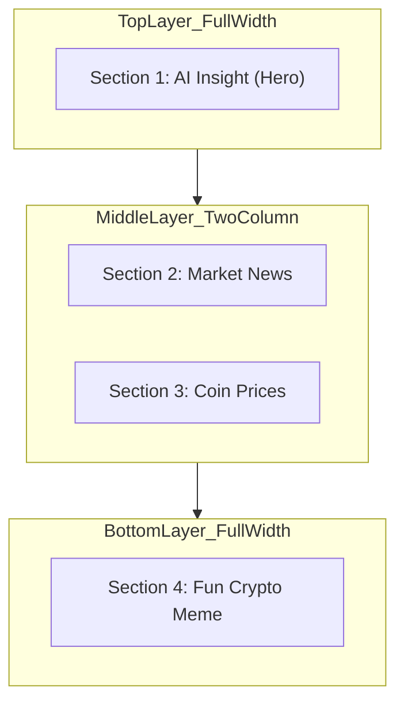
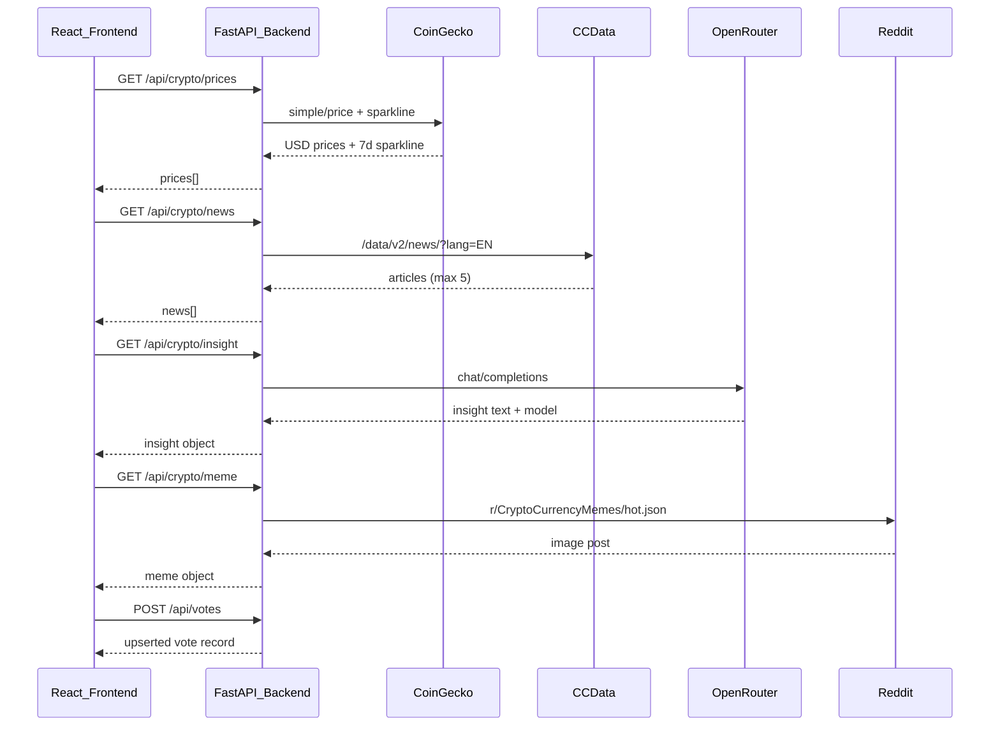

# Piggy Daily — Production Design Specification

> **Document status:** Immutable reference for all frontend builds.  
> **Last verified:** 2026-06-13 — codebase analysis **+ Playwright MCP screenshots** at `http://localhost:5173/dashboard` (desktop 1440×900, mobile 390×812).  
> **Screenshot archive:** [`design-spec-screenshots/`](design-spec-screenshots/)  
> **Primary implementation roots:** `src/pages/Dashboard.jsx`, `src/components/sections/*`, `src/components/ui/SectionCard.jsx`, `src/index.css`, `tailwind.config.js`

---

## 1. Overview & Core Philosophy

**Piggy Daily** is a streamlined, highly personalized daily crypto brief dashboard. The core philosophy is **uncluttered utility and high-signal personalization**. It delivers exactly four required content sections wrapped in a cohesive, aesthetically pleasing interface without extra financial noise or overwhelming product feature bloat.

The user experience follows a **"sandwich" layout structure** that establishes clear content hierarchy, guiding the user from an AI-powered custom summary to market details, concluding with a lighthearted visual wrap-up.

### 1.1 Product Constraints (Non-Negotiable)

| Constraint | Requirement |
| :--- | :--- |
| Section count | Exactly four: AI Insight, Market News, Coin Prices, Fun Crypto Meme |
| Personalization | Content ordering and emphasis driven by stored onboarding preferences |
| Feedback | Every section exposes thumbs-up / thumbs-down (meme section: target labels **Funny / Not funny**; see §3.3) |
| External secrets | Never exposed in the frontend; all integrations proxied through the FastAPI backend |
| Mascot scope | Sidebar brand avatar + single AI Insight illustration only (see §4.C) |

### 1.2 Application Shell

The workspace is a **fixed sidebar + scrollable main column** flex layout.

| Region | Behavior | Implementation |
| :--- | :--- | :--- |
| Sidebar | `w-64`, `bg-piggy-card`, `border-r border-piggy-border`, `p-6` | `Sidebar.jsx` |
| Sidebar (mobile) | Off-canvas drawer (`-translate-x-full`), overlay scrim `bg-piggy-charcoal/30`, toggled via hamburger | `md:static md:translate-x-0` breakpoint |
| Main content | `flex-1 overflow-y-auto`, padding `px-4 py-8` → `md:px-10 md:py-10` | `DashboardLayout.jsx` |
| Content container | `mx-auto max-w-4xl space-y-6` | `Dashboard.jsx` `#dashboard-content` |
| Scroll spy | Active nav section tracked with `rootMargin: "-15% 0px -55% 0px"` | `useScrollSpy.js` |

---

## 2. Layout & Grid Architecture (The "Sandwich" Structure)

On desktop viewports, dashboard content flows through three vertical layers inside `#dashboard-content`.



### 2.1 Layer Definitions

#### Layer 1 — Top (Hero Placement)

- **Section:** AI Insight of the Day (`section-insight`)
- **Width:** 100% of content container (`max-w-4xl`)
- **Card variant:** `hero` — elevated border `border-2 border-piggy-pink/35`, gradient `from-piggy-card via-piggy-card to-piggy-peach/25`, padding `p-8`
- **Expanded layout:** Dual-column content zone (text left, mascot right) — see §5.1

#### Layer 2 — Middle (2-Column Grid)

- **Sections:** Market News (`section-news`) + Coin Prices (`section-prices`)
- **Canonical desktop layout:**

```html
<!-- Target wrapper in Dashboard.jsx -->
<div class="grid grid-cols-1 gap-6 lg:grid-cols-2 lg:items-stretch">
  <MarketNewsSection />
  <CoinPricesSection />
</div>
```

| Viewport | Columns | Gap | Card height |
| :--- | :--- | :--- | :--- |
| `< lg` (< 1024px) | 1 (stacked) | `gap-6` (24px) | intrinsic |
| `≥ lg` (≥ 1024px) | 2 equal (`1fr 1fr`) | `gap-6` | `h-full` via `SectionCard` `flex flex-col` |

> **Implementation note (2026-06-13):** `Dashboard.jsx` currently renders all four sections in a single `space-y-6` column. The middle-layer `lg:grid-cols-2` wrapper is the **canonical target** and should be applied when aligning layout to this spec.

#### Layer 3 — Bottom (Closing Placement)

- **Section:** Fun Crypto Meme (`section-meme`)
- **Width:** 100% of content container
- **Card variant:** `compact` — padding `p-5`, title `text-base`
- **Expanded:** Meme image centered within card viewport with aspect-ratio-safe constraints — see §8

### 2.2 Section Ordering

Default sandwich order is fixed with AI Insight always first:

1. `section-insight`
2. `section-news`
3. `section-prices`
4. `section-meme`

Tail sections (2–4) may reorder based on `content_types` preference via `orderDashboardSections()` in `config/personalization.js`. AI Insight is **never** reordered.

#### Verified render order (Playwright, 2026-06-13)

Test user preferences: `content_types: ["Market News", "Fun"]` (plus full asset list in DB). Observed vertical stack:

| Position | Section | Section # badge |
| :--- | :--- | :--- |
| 1 | AI Insight of the Day | 1 |
| 2 | Market News | 2 |
| 3 | Fun Crypto Meme | 4 |
| 4 | Coin Prices | 3 |

> **Spec vs. live UI:** Personalization elevates **Meme above Prices**, breaking the canonical "middle layer = News + Prices" pairing. The sandwich middle grid (`lg:grid-cols-2`) must wrap the **personalized** middle pair (here: News + Meme), not assume fixed section IDs.

### 2.3 Expansion Model (Accordion)

- **Single expanded section:** Only one section may be expanded at a time (`expandedSectionId` state in `Dashboard.jsx`).
- **Default state:** All sections collapsed on load.
- **Toggle:** Header click, chevron button, or sidebar nav (navigate + expand).
- **Animation:** CSS grid row transition `grid-rows-[0fr]` ↔ `grid-rows-[1fr]`, `duration-slow` (320ms), `ease-product`.
- **Reduced motion:** Transitions and stagger animations disabled under `prefers-reduced-motion: reduce`.

---

## 3. Component Architecture & Interactive States

Every section is enclosed in the shared `SectionCard` component (`src/components/ui/SectionCard.jsx`).

### 3.1 Section Card Anatomy

```
┌─────────────────────────────────────────────────────┐
│ [①] [icon] Section Title                    [⌄]    │  ← SectionHeader
├─────────────────────────────────────────────────────┤
│ Collapsed preview OR expanded content panel         │  ← Content zone
│ (source attribution + related coins when expanded)  │
├─────────────────────────────────────────────────────┤
│ [👍 Helpful]  [👎 Not helpful]                     │  ← FeedbackControls
└─────────────────────────────────────────────────────┘
```

#### Section Number Badge

| Property | Value |
| :--- | :--- |
| Size | `h-9 w-9` |
| Shape | `rounded-full` |
| Background | `bg-piggy-pink` (`#FF8BA7`) |
| Text | `text-sm font-bold text-white` |
| Shadow | `shadow-sm` |

#### Card Interactive States

| State | Visual behavior |
| :--- | :--- |
| Collapsed hover | `border-2`, `border-piggy-pink/35`, peach gradient wash, `shadow-lg` |
| Expanded | `border-piggy-pink/45`, `shadow-lg`, `data-expanded="true"` |
| Refreshing | Full-card overlay `bg-piggy-card/60 backdrop-blur-[1px]` + pink spinner |
| Error | `StateMessage` error variant above preview; voting disabled |
| Stagger entrance | `motion-stagger-item`, delay `staggerIndex * 60ms` |

### 3.2 Collapsed State (Default)

| Element | Specification |
| :--- | :--- |
| Section indicator | Number badge (see above) |
| Section header | `font-heading font-semibold text-piggy-charcoal`; size per variant |
| Content preview | Section-specific `collapsedPreview` slot; fallback `line-clamp-2 text-sm text-piggy-gray` |
| Voting block | `FeedbackControls` — always visible in footer `border-t border-piggy-border pt-4 mt-6` |
| Expansion affordance | Header row + chevron toggle; `expandLabel` passed per section (e.g. "Open full market news") |

### 3.3 Expanded State

| Element | Specification |
| :--- | :--- |
| Full content | Section-specific `expandedContent` via `SectionContent` wrapper |
| Metadata | `border-t border-piggy-border pt-4 mt-4` footer inside expanded panel |
| Source label | `text-xs text-piggy-gray` — "Source:" + `font-medium text-piggy-charcoal` value |
| Related coins | Peach pills `bg-piggy-peach/40 px-2.5 py-0.5 text-xs` (Insight + Prices only) |
| Persistent feedback | `FeedbackControls` remains in card footer below expanded content |

#### Voting Labels by Section

| Section | Canonical labels | Current implementation |
| :--- | :--- | :--- |
| AI Insight | Helpful / Not helpful | ✅ `FeedbackControls.jsx` |
| Market News | Helpful / Not helpful | ✅ |
| Coin Prices | Helpful / Not helpful | ✅ |
| Fun Crypto Meme | **Funny / Not funny** | ⚠️ Uses Helpful / Not helpful — label override pending |

### 3.4 Feedback Controls — Behavior & Visual States

**Component:** `src/components/ui/FeedbackControls.jsx`  
**API:** `POST /api/votes` via `submitVote()`

#### Interaction Flow

1. Buttons disabled when `submitting`, `itemReference` empty, or `contentSnapshot` null (loading/empty states).
2. On click: **optimistic UI** — `selectedVote` set immediately.
3. Request payload: `{ section, item_reference, vote_value, content_snapshot }` where `vote_value` is `1` (up) or `-1` (down).
4. Success: status message "Thanks — Piggy will tune future briefs." (`text-piggy-positive`, 3s auto-dismiss).
5. Failure: revert `selectedVote`, show "Could not save feedback. Try again." (`text-piggy-negative`).
6. `itemReference` change (refresh): vote state resets via `useEffect`.

#### Visual State Matrix

| State | Helpful (vote=1) | Not helpful (vote=-1) | Idle |
| :--- | :--- | :--- | :--- |
| Background | `bg-piggy-pink/30` | `bg-piggy-negative/15` | `bg-piggy-cream` |
| Text | `text-piggy-charcoal` | `text-piggy-negative` | `text-piggy-gray` |
| Ring | `ring-1 ring-piggy-pink` | `ring-1 ring-piggy-negative/40` | none |
| Scale | `scale-105` when selected | `scale-105` when selected | default |
| Hover (idle) | — | — | `hover:bg-piggy-peach/30 hover:text-piggy-charcoal` |
| Submitting | Inline `Spinner` replaces thumb icon on active button | same | — |
| Disabled | `opacity-50 cursor-not-allowed` | same | same |

#### Item Reference Keys (for deduplication)

| Section | `item_reference` composition |
| :--- | :--- |
| Insight | `insight.source` or first 64 chars of insight text |
| News | Comma-joined article `id` values |
| Prices | Comma-joined coin `id` values |
| Meme | `meme.id` or `meme.image_url` |

---

## 4. Visual Design Tokens & Style Sheet

### 4.A Color Palette

| Token Name | CSS Variable | Tailwind Class | Hex | Applied Elements |
| :--- | :--- | :--- | :--- | :--- |
| **Primary Pink** | `--color-piggy-pink` | `piggy-pink` | `#FF8BA7` | Nav active state, section badges, primary actions, sparkline baseline (positive) |
| **Soft Peach** | `--color-piggy-peach` | `piggy-peach` | `#FFC9A5` | Gradient highlights, hover washes, related-coin pills |
| **Warm Cream** | `--color-piggy-cream` | `piggy-cream` | `#FFF8F1` | App background (`body`), news article fill, table header |
| **Card White** | `--color-piggy-card` | `piggy-card` | `#FFFDF9` | Cards, sidebar panels |
| **Charcoal** | `--color-piggy-charcoal` | `piggy-charcoal` | `#2E2A27` | Primary typography, headings, price values |
| **Warm Gray** | `--color-piggy-gray` | `piggy-gray` | `#7A746F` | Secondary text, metadata, symbols, table headers |
| **Border** | `--color-piggy-border` | `piggy-border` | `#F1E7DE` | Card borders, dividers, sparkline grid lines |
| **Positive Green** | `--color-piggy-positive` | `piggy-positive` | `#55B685` | Positive % change, bullish sparkline stroke/fill |
| **Negative Red** | `--color-piggy-negative` | `piggy-negative` | `#E56B6F` | Negative % change, bearish sparkline stroke/fill |

**Source of truth files:** `src/index.css` (`:root` block) and `tailwind.config.js` (`theme.extend.colors.piggy`).

### 4.B Typography

| Role | Family | Weight | Tailwind |
| :--- | :--- | :--- | :--- |
| Headings | Space Grotesk | 600–700 | `font-heading font-semibold` / `font-bold` |
| Body & controls | Inter | 400–500 | `font-body` (body default), `font-medium` on controls |
| Tabular data | Inter | 500 | `tabular-nums` on prices and percentages |
| Section labels | Space Grotesk | 600 | `text-sm font-semibold uppercase tracking-wide` (e.g. "Piggy's Take") |

**Loading in app:** Google Fonts via `index.html`.

### 4.C Mascot (Piggy) Implementation Rules

| Permitted | Prohibited |
| :--- | :--- |
| Small brand avatar in sidebar (`PiggyAvatar`, `size="sm"`) | Mascot inside every section card |
| Single illustration in expanded AI Insight (`InsightIllustration`, `/piggy-guide.png`) | Full-screen decorative backdrops |
| Sidebar footer decorative image (`/piggy-sidebar-mascot-transparent.png`) — navigation chrome only | Mascot in Market News, Prices, or Meme cards |
| Prices section trader illustration (`PricesIllustration`) — editorial graphic, not Piggy mascot | Multiple Piggy instances in hero collapsed state |

**Insight illustration treatment:** `insight-guide-mascot` radial mask + `drop-shadow`; fallback SVG uses palette pink/peach/charcoal.

### 4.D Motion Tokens

| Token | Value | Usage |
| :--- | :--- | :--- |
| `--motion-fast` | 120ms | Micro-interactions |
| `--motion-normal` | 200ms | Hover, fade, image opacity |
| `--motion-slow` | 320ms | Expand/collapse, price flash, sparkline draw |
| `--motion-slower` | 480ms | Sidebar slide |
| `--ease-out-product` | `cubic-bezier(0.16, 1, 0.3, 1)` | Default easing |
| `--spring-snappy` | `cubic-bezier(0.34, 1.56, 0.64, 1)` | Press feedback |

---

## 5. Section 1 — AI Insight of the Day (Hero)

**Component:** `src/components/sections/AiInsightSection.jsx`  
**Card variant:** `hero`  
**Skeleton layout:** `hero`  
**Backend:** `GET /api/crypto/insight` → OpenRouter (or simulated fallback)

### 5.1 Expanded Dual-Column Layout (Desktop)

#### Canonical Target (Production Reference)

| Column | Width | Content |
| :--- | :--- | :--- |
| Text (left) | **65%** | Piggy's Take body, confidence, focus assets |
| Illustration (right) | **35%** | `InsightIllustration` centered vertically |

```css
/* Target CSS pattern */
.insight-expanded-grid {
  display: grid;
  grid-template-columns: 1fr;
  gap: 1.5rem;
}
@media (min-width: 768px) {
  .insight-expanded-grid {
    grid-template-columns: 65fr 35fr;
    align-items: center;
  }
}
```

#### Current Implementation (Overlay Pattern)

The live component uses **absolute-positioned mascot** with reserved right padding rather than explicit CSS grid fractions:

| Breakpoint | Text column padding-right | Illustration size | Illustration position |
| :--- | :--- | :--- | :--- |
| default | `pr-28` (7rem) | `h-36 w-36` | `absolute -bottom-8 -right-3` |
| `sm` | `pr-36` (9rem) | `h-44 w-44` | `-bottom-10 -right-4` |
| `md` | `pr-44` (11rem) | `h-52 w-52` | `-bottom-10 -right-4` |

Text column is `relative z-10`; illustration is `pointer-events-none z-0`.

#### Measured layout (Playwright bounding boxes, desktop 1440px, expanded)

| Metric | Measured value | Notes |
| :--- | :--- | :--- |
| Content container width | **896px** | `max-w-4xl` inside main column |
| Hero card inner content width | **828px** | After `p-8` (32px) card padding |
| Text column width | **652px** | ≈ **78.7%** of inner content |
| Mascot reserve (padding + absolute) | **~176px** | ≈ **21.3%** — wider than 35% target because mascot overlaps bottom-right |
| Collapsed preview text block | **828px** wide, `line-clamp-2` | See `03-desktop-insight-expanded.png` / collapsed `02` |
| Long AI output | Full paragraph rendered (no scroll) | OpenRouter response can include `**markdown**` markers rendered as literal asterisks |

> **Alignment action:** Migrate from overlay padding to explicit `65fr / 35fr` grid at `md:` for spec compliance. Consider rendering AI markdown or stripping `**` tokens.

### 5.2 Text Structure & Typography Hierarchy

```
Piggy's Take          ← h3, text-sm font-semibold uppercase tracking-wide text-piggy-pink
[insight body]        ← collapsed: line-clamp-2 text-sm | expanded: text-base md:text-lg leading-relaxed
Confidence: [value]   ← dl, text-xs text-piggy-gray / dd font-semibold text-piggy-charcoal
Focus: [tickers]      ← optional, same dl styling
```

#### Content Processing

| Function | Behavior |
| :--- | :--- |
| `extractPiggyTake()` | Returns first sentence (`/^[^.!?]+[.!?]?/`); if no match, truncates at **160 characters** with ellipsis |
| `inferConfidence()` | Keyword scoring → `High` / `Medium` / `Low` |
| `formatFocusAssets()` | Maps user assets to tickers (`BTC · ETH`) |

#### AI Generation Limits (Backend)

| Parameter | Value |
| :--- | :--- |
| Prompt constraint | "at most 3 sentences" |
| `max_tokens` | 180 |
| `temperature` | 0.7 |
| Fallback | Simulated insight when `OPENROUTER_API_KEY` unset or request fails |

#### Long Text Handling

| State | Behavior |
| :--- | :--- |
| Collapsed preview | `line-clamp-2` on first-sentence extract |
| Expanded | **Full text rendered** — no max-height, no scroll container, no truncation |
| Empty | "No insight available right now." (`text-sm text-piggy-gray`) |

### 5.3 Loading & Error States

| Status | UI |
| :--- | :--- |
| `loading` | `ContentSkeleton layout="hero"` — 4 shimmer bars (`h-4` / `h-5` widths 100%, 100%, 80%, 66%) |
| `refreshing` | Card overlay spinner; prior content remains underneath |
| `error` | `StateMessage` + retry; voting disabled |
| `success` (empty) | `SectionContent` empty message |

### 5.4 Source Attribution

| `insight.source` | Display label |
| :--- | :--- |
| `openrouter` | `OpenRouter ({model})` |
| `simulated` | `Simulated insight` |
| other | raw `source` string |

---

## 6. Section 2 — Market News

**Component:** `src/components/sections/MarketNewsSection.jsx`  
**Skeleton layout:** `text`  
**Backend:** `GET /api/crypto/news` → CCData CryptoCompare (`min-api.cryptocompare.com`)  
**Article count:** **5** (backend slices `raw_data[:5]`)

### 6.1 Collapsed Preview

- Renders **top 3** articles (`news.slice(0, 3)`)
- List: `ul.space-y-2`
- Each item: `flex gap-2 text-sm leading-snug text-piggy-charcoal`

#### Bullet / Indicator Tokens

| Element | Classes | Dimensions |
| :--- | :--- | :--- |
| Bullet dot | `rounded-full bg-piggy-pink shrink-0` | `h-1.5 w-1.5` |
| Bullet offset | `mt-1.5` | Aligns with first text line |
| Title | `line-clamp-2` | Max 2 lines, ellipsis overflow |

### 6.2 Expanded List Layout

- Container: `ul.space-y-3` (12px vertical gap between articles)
- Stagger: per-item `--motion-delay: ${index * 40}ms`

#### Article Block Structure

```
┌──────────────────────────────────────────┐
│  [Article Title — ExternalLink]          │  ← news-article-link
│  Source · Jan 12, 2026                   │  ← metadata row
└──────────────────────────────────────────┘
```

| Property | Value |
| :--- | :--- |
| Container | `news-article-item rounded-lg border border-piggy-border bg-piggy-cream/50 p-4` |
| Title element | `ExternalLink` with class `news-article-link` |
| Title truncation (expanded) | **None** — full title wraps naturally |
| Metadata row | `mt-1 flex flex-wrap gap-2 px-3 text-xs text-piggy-gray` |
| Source | `article.source` (from `source_info.name`) |
| Separator | `·` between source and timestamp |
| Timestamp | `formatTimestamp(published_at)` — Unix seconds → `MMM D, YYYY`; omitted if null |

### 6.3 Hover & Focus States

Defined in `src/index.css`:

| Target | Hover effect |
| :--- | :--- |
| `.news-article-link` | `border-piggy-pink/35`, `bg-piggy-peach/45`, rounded `px-3 py-2` |
| `.news-article-item:has(.news-article-link:hover)` | Parent border `piggy-pink/30`, background `piggy-peach/20`, `box-shadow: 0 2px 12px rgba(46,42,39,0.06)` |
| Active press | Stronger peach background `piggy-peach/60` |

### 6.4 Edge Cases

| Case | Behavior |
| :--- | :--- |
| CCData failure / empty | Static 5-article fallback (CoinDesk, Ethereum Foundation, etc.) |
| Collapsed with 1 article | Preview text = article title only |
| Collapsed with 2+ articles | `"{n} stories today — {first title}"` |
| Missing URL | Link still rendered if `article.url` present in data |
| Voting snapshot | `buildNewsSnapshot(news)` — titles + sources serialized |

### 6.5 Source Label

Displayed in expanded metadata footer: **`CCData CryptoCompare`**

---

## 7. Section 3 — Coin Prices

**Component:** `src/components/sections/CoinPricesSection.jsx`  
**Skeleton layout:** `list`  
**Backend:** `GET /api/crypto/prices` → CoinGecko (`api.coingecko.com/api/v3/simple/price`)

### 7.1 Collapsed Preview — Mini Table

Rendered via `PricesMiniTable` — shows **up to 4 coins** (`prices.slice(0, 4)`).

#### Table Architecture

| Element | Specification |
| :--- | :--- |
| Wrapper | `overflow-hidden rounded-lg border border-piggy-border` |
| Table | `w-full text-sm` |
| Header row | `border-b border-piggy-border bg-piggy-cream/50 text-xs text-piggy-gray` |
| Header cells | `px-3 py-2 font-medium` — Coin (left), Price (right), 24h (right) |
| Body rows | `border-b border-piggy-border/60 last:border-0` |
| Row padding | `px-3 py-2.5` |

#### Column Alignment & Typography

| Column | Alignment | Content styling |
| :--- | :--- | :--- |
| Coin | Left | `name`: `font-medium text-piggy-charcoal` + `symbol`: `ml-1 text-xs uppercase text-piggy-gray` |
| Price | Right | `font-medium tabular-nums text-piggy-charcoal` + `formatUsd()` |
| 24h change | Right | `font-medium tabular-nums` + conditional color (see §7.2) |

### 7.2 Positive / Negative Color Logic

**Rule:** `coin.change_24h >= 0` → positive; otherwise negative.

| Condition | Class | Hex |
| :--- | :--- | :--- |
| `change_24h >= 0` | `text-piggy-positive` | `#55B685` |
| `change_24h < 0` | `text-piggy-negative` | `#E56B6F` |
| `change_24h == null` | Treated as negative branch in sparkline; display shows `—` via `formatPercent` |

**Formatting:**

- USD: `formatUsd()` — `Intl.NumberFormat`, 2 decimals if ≥ $1, else 6
- Percent: `formatPercent()` — explicit `+` prefix for non-negative values, 2 decimal places

#### Price Flash Animation

When `price_usd` changes between refreshes:

- Affected cells gain `motion-flash` for **320ms** (`--motion-slow`)
- Flash color: `rgba(255, 139, 167, 0.2)` → transparent
- Disabled under `prefers-reduced-motion`

### 7.3 Expanded View — Chart Grid

- Outer: `space-y-6`
- Coin cards: `grid gap-4 sm:grid-cols-2` (2-column at `≥ 640px`)
- Per-card: `motion-card rounded-xl border border-piggy-border bg-piggy-cream/40 p-4`

#### Expanded Row Layout

```
┌─────────────────────────────────────┐
│ Bitcoin          $67,432.10         │
│ BTC              +2.34%             │
│ [════════ sparkline ════════]       │
│ 7D TREND                            │
│ 24h volume: $28.4B                  │
└─────────────────────────────────────┘
```

| Element | Classes |
| :--- | :--- |
| Name | `font-medium text-piggy-charcoal` |
| Symbol | `text-xs uppercase text-piggy-gray` |
| Price (expanded) | `text-lg font-bold tabular-nums text-piggy-charcoal` |
| 24h (expanded) | `text-sm font-medium tabular-nums` + positive/negative color |
| Volume | `text-xs text-piggy-gray`, value `font-medium text-piggy-charcoal` |

#### PricesIllustration Footer

- Separated by `border-t border-piggy-border pt-6`
- Centered `figure`, aspect `aspect-[16/10] sm:aspect-[5/3]`

### 7.4 Sparkline Chart Specification

**Component:** `src/components/ui/PriceSparkline.jsx`  
**Utility:** `src/utils/priceSparkline.js`

| Property | Value |
| :--- | :--- |
| SVG viewBox | `160 × 56` |
| Rendered height | `h-14` (56px) default; `sm:h-16` (64px) in expanded cards |
| Width | `w-full` (`preserveAspectRatio="none"` — stretches to container) |
| Stroke width | `2` |
| Stroke caps | `round` / `round` (linecap / linejoin) |
| Area fill opacity | `0.12` |
| Endpoint marker | Circle `r=3` at last data point |
| Grid lines | 3 horizontal dashed lines at 25/50/75% height, `stroke-piggy-border`, `strokeDasharray="3 4"` |
| Baseline | Dashed line at series start Y, stroke matches trend color, `strokeOpacity="0.25"` |

#### Data Source Priority

1. **Real series:** `coin.sparkline_7d` from CoinGecko (`sparkline_in_7d.price`, downsampled to ≤32 points)
2. **Synthetic fallback:** Seeded PRNG from `coin.id` + `change_24h` — 24 points interpolated toward end price

#### Color States (24h Trend)

| `change24h` | Stroke / fill variable | Color |
| :--- | :--- | :--- |
| `>= 0` | `--color-piggy-positive` | `#55B685` |
| `< 0` | `--color-piggy-negative` | `#E56B6F` |

#### Animation

- Line draw: `motion-draw-stroke` — `stroke-dashoffset` 200→0 over 320ms
- Disabled under reduced motion

#### Responsive Scaling

- SVG scales horizontally to 100% card width; height fixed by Tailwind class
- On narrow mobile, sparkline compresses horizontally (aspect stretch) — acceptable tradeoff for at-a-glance trend

### 7.5 Edge Cases

| Case | Behavior |
| :--- | :--- |
| No user assets / unsupported assets | Empty state message; empty prices array |
| CoinGecko failure | Empty array; error state on section |
| Missing sparkline data | Synthetic series generated |
| Single coin | Table 1 row; expanded grid single column until `sm:` |

### 7.6 Source Label

**`CoinGecko`**

---

## 8. Section 4 — Fun Crypto Meme (Bottom Full Width)

**Component:** `src/components/sections/MemeSection.jsx`  
**Card variant:** `compact`  
**Skeleton layout:** `meme`  
**Backend:** `GET /api/crypto/meme` → Reddit public API (`r/CryptoCurrencyMemes/hot.json`) with curated static fallback

> **Note on "meme-api":** There is no third-party `meme-api` SaaS in this project. The meme integration layer is the **Reddit JSON endpoint**, proxied through the backend. Fallback uses `STATIC_MEME_FALLBACK` (Imgur curated image).

### 8.1 Collapsed Preview

```
┌────────┬─────────────────────────────┐
│ [thumb]│  line-clamp-2 preview text  │
│ 4.5rem │  text-sm text-piggy-gray     │
└────────┴─────────────────────────────┘
```

| Element | Constraint |
| :--- | :--- |
| Thumbnail wrapper | `h-[4.5rem] w-[4.5rem] shrink-0` |
| Thumbnail image | `rounded-lg object-cover` |
| Thumbnail fallback | `bg-piggy-peach/40` + 🎁 emoji, `text-2xl` |
| Preview text | `line-clamp-2 text-sm text-piggy-gray` |
| Layout | `flex items-center gap-4` |

### 8.2 Expanded Image Container

| Property | Value | Rationale |
| :--- | :--- | :--- |
| Wrapper | `w-full` | Spans card content area |
| Image classes | `max-h-80 w-full rounded-lg object-contain` | **Max height 320px** prevents ultra-tall memes breaking vertical rhythm |
| Width | `w-full` | Horizontal fill up to card bounds |
| `object-contain` | Preserves aspect ratio; letterboxing acceptable | Prevents portrait/landscape distortion |
| Alignment | Default block flow — image centered horizontally via full width + contain | |
| Max width (implicit) | Constrained by `#dashboard-content` `max-w-4xl` (~896px) | |

#### Aspect Ratio Safety Matrix

| Meme aspect | Rendered behavior |
| :--- | :--- |
| Wide (16:9) | Full width, height < 320px, vertical padding implicit |
| Tall (9:16) | Height capped at 320px, horizontal letterboxing |
| Square (1:1) | Fits within 320px box, centered |

### 8.3 Title & Link Below Image

| Element | Styling |
| :--- | :--- |
| Container | `space-y-3` |
| Title | `text-sm text-piggy-charcoal` — only if `meme.title` present |
| Reddit link | `ExternalLink`, `text-xs font-medium text-piggy-pink hover:opacity-80`, label "View on Reddit →" |
| Vertical order | Image → title → permalink |

### 8.4 Loading & Skeleton States

#### Initial Section Load (`skeletonLayout="meme"`)

- Shimmer thumbnail: `motion-shimmer h-16 w-16 rounded-lg`
- Two text shimmer bars: `w-3/4` and `w-1/2` (h-3 on second)

#### Image Load (`LazyImage.jsx`)

| Phase | Visual |
| :--- | :--- |
| Before load | `absolute inset-0 animate-pulse rounded-lg bg-piggy-border` overlay |
| Loaded | Image fades `opacity-0` → `opacity-100`, `duration-normal` (200ms) |
| Error / no src | `MemeImageFallback` — `h-48 w-full`, dashed `border-piggy-border`, "Image unavailable" |
| Native loading | `loading="lazy"` attribute on `` |

### 8.5 Meme Rotation

- New meme selected on every dashboard refresh (`loadDashboard()` in `useDashboardData.js`)
- Backend: `random.choice(image_posts)` from Reddit hot feed
- Voting `item_reference` changes when meme identity changes → prior vote state clears

### 8.6 Source Labels

| `meme.source` | Display |
| :--- | :--- |
| `reddit` | `Reddit r/CryptoCurrencyMemes` |
| `fallback` | `Curated fallback` |

---

## 9. Global Responsive & State Transitions

### 9.1 Breakpoint Reference (Tailwind Defaults)

| Breakpoint | Min width | Primary dashboard effects |
| :--- | :--- | :--- |
| default | 0px | Single-column sections, sidebar drawer, `px-4 py-8` |
| `sm` | 640px | Insight illustration `h-44`, sparkline `h-16`, prices expanded grid 2-col |
| `md` | 768px | Sidebar static visible, main `px-10 py-10`, insight illustration `h-52`, hero title `text-2xl` |
| `lg` | 1024px | **Target:** middle layer `grid-cols-2` for News + Prices |
| `xl` | 1280px | No additional dashboard-specific rules |

### 9.2 Sandwich Responsive Behavior

| Layer | Mobile (< `md`) | Tablet (`md`–`lg`) | Desktop (`≥ lg`) |
| :--- | :--- | :--- | :--- |
| Hero (Insight) | Full width, stacked text + smaller mascot overlay | Increased mascot `h-52`, title `text-2xl` | Full width; target 65/35 grid |
| Middle (News + Prices) | Stacked single column | Stacked single column | **Side-by-side 50/50 grid** |
| Meme | Full width, `max-h-80` image | Same | Same |

### 9.3 Hero Card Scaling (Mobile)

| Property | Mobile | `md+` |
| :--- | :--- | :--- |
| Card padding | `p-8` (hero variant constant) | `p-8` |
| Title | `text-xl` | `text-2xl` |
| Body text | `text-base` | `text-lg` |
| Mascot | `h-36 w-36` overlay | `h-52 w-52` overlay |
| Right padding for text | `pr-28` | `pr-44` |

### 9.4 Meme Card Scaling (Mobile)

- Collapsed thumbnail remains `4.5rem` — touch-friendly
- Expanded image `max-h-80` unchanged across breakpoints
- Card padding `p-5` (compact variant)

### 9.5 Section Expand/Collapse Transition

```css
/* SectionCard expanded panel */
grid transition-[grid-template-rows] duration-slow ease-product
grid-rows-[0fr]  /* collapsed */
grid-rows-[1fr]  /* expanded */
```

- Inner overflow: `overflow-hidden` on grid child
- Chevron: `rotate-180` when expanded, `duration-slow`
- `aria-hidden={!expanded}` on content panel
- `scroll-mt-24` on cards for anchor scroll offset below header

### 9.6 Dashboard Refresh State Machine

| Phase | Per-section status | Global UI |
| :--- | :--- | :--- |
| Initial load | `loading` | All skeletons visible |
| Loaded | `success` / `empty` | Content rendered, voting enabled |
| User refresh | `refreshing` | Semi-transparent overlay + spinner per card |
| Partial failure | Mixed `success` + `error` | Toast: "{n} sections failed to refresh" |
| Full success refresh | All `success` | Toast: "Dashboard updated at {time}" |

---

## 10. API Backing Layers & Data Architecture

All frontend fetches route through the Vite dev proxy (`/api` → `http://127.0.0.1:8000`) to FastAPI. **No third-party API keys appear in the frontend.**



### 10.1 Endpoint Catalog

| Frontend function | HTTP route | Backend handler | External provider |
| :--- | :--- | :--- | :--- |
| `fetchCryptoPrices()` | `GET /api/crypto/prices` | `dashboard_service.get_user_prices` | **CoinGecko** |
| `fetchCryptoNews()` | `GET /api/crypto/news` | `dashboard_service.get_market_news` | **CCData** (CryptoCompare) |
| `fetchCryptoInsight()` | `GET /api/crypto/insight` | `dashboard_service.get_ai_insight` | **OpenRouter** |
| `fetchCryptoMeme()` | `GET /api/crypto/meme` | `dashboard_service.get_crypto_meme` | **Reddit** (meme integration) |
| `submitVote()` | `POST /api/votes` | `vote_service` | MongoDB (internal) |

### 10.2 CoinGecko (Prices)

| Property | Detail |
| :--- | :--- |
| Endpoint | `https://api.coingecko.com/api/v3/simple/price` |
| Auth | None (public free tier) |
| Params | `ids`, `vs_currencies=usd`, `include_24hr_change`, `include_24hr_vol`, `sparkline=true` |
| Asset mapping | `bitcoin`, `ethereum`, `solana`, `cardano` |
| Response fields used | `usd`, `usd_24h_change`, `usd_24h_vol`, `sparkline_in_7d.price` |
| Failure behavior | Empty array → section error state |
| Frontend label | `CoinGecko` |

### 10.3 CCData / CryptoCompare (News)

| Property | Detail |
| :--- | :--- |
| Endpoint | `https://min-api.cryptocompare.com/data/v2/news/?lang=EN` |
| Auth | Optional `CCDATA_API_KEY` via `authorization: Apikey {key}` header |
| Article limit | **5** |
| Mapped fields | `id`, `title`, `url`, `source_info.name`, `published_on` |
| Failure behavior | `STATIC_NEWS_FALLBACK` (5 curated articles) |
| Frontend label | `CCData CryptoCompare` |

### 10.4 OpenRouter (AI Insight)

| Property | Detail |
| :--- | :--- |
| Endpoint | `https://openrouter.ai/api/v1/chat/completions` |
| Auth | `OPENROUTER_API_KEY` (Bearer) |
| Model | `OPENROUTER_MODEL` env (default: `meta-llama/llama-3-8b-instruct:free`) |
| Personalization inputs | `investor_type`, `assets[]`, `content_types[]` from user preferences |
| Failure behavior | Simulated insight (`source: "simulated"`) |
| Frontend label | `OpenRouter ({model})` or `Simulated insight` |

### 10.5 Reddit (Meme Integration)

| Property | Detail |
| :--- | :--- |
| Endpoint | `https://www.reddit.com/r/CryptoCurrencyMemes/hot.json?limit=50` |
| Auth | None (public JSON, User-Agent header required) |
| Selection | Random image post from filtered results |
| Mapped fields | `id`, `title`, `image_url`, `permalink`, `source: "reddit"` |
| Failure behavior | `STATIC_MEME_FALLBACK` (Imgur image, `source: "fallback"`) |
| Frontend label | `Reddit r/CryptoCurrencyMemes` or `Curated fallback` |

### 10.6 Votes (Internal Persistence)

| Property | Detail |
| :--- | :--- |
| Endpoint | `POST /api/votes` |
| Payload | `section`, `item_reference`, `vote_value` (1/-1), `content_snapshot` |
| Dedup strategy | Upsert on `(user_id, section, item_reference)` |
| Snapshot purpose | Preserve rated content context for future recommendation tuning |

### 10.7 Parallel Fetch Strategy

`useDashboardData.loadDashboard()` fetches all four sections concurrently via `Promise.all`. Each section resolves independently — one provider failure does not block others.

---

## 11. Implementation Alignment Checklist

Use this checklist when reviewing PRs against the spec.

| # | Requirement | Status |
| :--- | :--- | :--- |
| 1 | Sandwich layer order (Insight → News+Prices → Meme) | ⚠️ Personalization reorders tail; live: Insight→News→**Meme**→Prices |
| 2 | `lg:grid-cols-2` for News + Prices | ⚠️ Not yet in `Dashboard.jsx` |
| 3 | Hero 65/35 dual-column at `md+` | ⚠️ Uses overlay padding pattern |
| 4 | Color tokens via `piggy-*` classes | ✅ |
| 5 | Typography Space Grotesk + Inter | ✅ |
| 6 | Section card collapsed/expanded states | ✅ |
| 7 | Feedback on all sections | ✅ (meme labels pending) |
| 8 | News: 5 articles, 3 in collapsed preview | ✅ |
| 9 | Prices: positive/negative color logic | ✅ |
| 10 | Sparkline trend colors match 24h sign | ✅ |
| 11 | Meme: `max-h-80 object-contain` | ✅ |
| 12 | Meme rotates on refresh | ✅ |
| 13 | API secrets server-side only | ✅ |
| 14 | Mascot scope restrictions | ✅ (sidebar footer image is nav chrome) |

---

## 12. File Map (Quick Reference)

| Concern | Primary files |
| :--- | :--- |
| Page layout | `src/pages/Dashboard.jsx`, `src/components/layout/DashboardLayout.jsx` |
| Section content | `src/components/sections/AiInsightSection.jsx`, `MarketNewsSection.jsx`, `CoinPricesSection.jsx`, `MemeSection.jsx` |
| Card shell | `src/components/ui/SectionCard.jsx`, `SectionContent.jsx`, `ContentSkeleton.jsx` |
| Feedback | `src/components/ui/FeedbackControls.jsx`, `src/api/votes.js` |
| Sparklines | `src/components/ui/PriceSparkline.jsx`, `src/utils/priceSparkline.js` |
| Images | `src/components/ui/LazyImage.jsx`, `InsightIllustration.jsx` |
| Tokens & motion | `src/index.css`, `tailwind.config.js` |
| Data fetching | `src/hooks/useDashboardData.js`, `src/api/dashboard.js` |
| Backend integrations | `backend/app/services/external/integrations.py`, `backend/app/api/routes/dashboard.py` |

---

## 13. Visual Verification — Playwright MCP Capture Log

Screenshots captured via **Playwright MCP** against the live dev build (`frontend` @ `:5173`, `backend` @ `:8001`). Use these as the visual ground truth when reviewing PRs.

### 13.1 Screenshot Index

| File | Viewport | State | Purpose |
| :--- | :--- | :--- | :--- |
| [`01-desktop-collapsed-fullpage.png`](design-spec-screenshots/01-desktop-collapsed-fullpage.png) | 1440×900 | Initial load | Baseline desktop stack |
| [`02-desktop-all-collapsed.png`](design-spec-screenshots/02-desktop-all-collapsed.png) | 1440×900 | All sections collapsed | Default dashboard density |
| [`03-desktop-insight-expanded.png`](design-spec-screenshots/03-desktop-insight-expanded.png) | 1440×900 | AI Insight expanded | Hero dual-column + mascot overlay |
| [`04-desktop-news-expanded.png`](design-spec-screenshots/04-desktop-news-expanded.png) | 1440×900 | Market News expanded | 5-article list + source footer |
| [`05-desktop-prices-expanded.png`](design-spec-screenshots/05-desktop-prices-expanded.png) | 1440×900 | Coin Prices expanded | 2×2 sparkline grid + trader illustration |
| [`06-desktop-meme-expanded.png`](design-spec-screenshots/06-desktop-meme-expanded.png) | 1440×900 | Meme expanded | `max-h-80` image containment |
| [`07-mobile-meme-expanded.png`](design-spec-screenshots/07-mobile-meme-expanded.png) | 390×812 | Meme expanded | Mobile image scaling |
| [`08-mobile-all-collapsed.png`](design-spec-screenshots/08-mobile-all-collapsed.png) | 390×812 | All collapsed | Mobile single-column + hamburger |

**Accessibility snapshots with bounding boxes:** [`01-desktop-collapsed-snapshot.md`](design-spec-screenshots/01-desktop-collapsed-snapshot.md), [`08-mobile-collapsed-snapshot.md`](design-spec-screenshots/08-mobile-collapsed-snapshot.md)

### 13.2 Measured Chrome & Spacing (Desktop 1440px)

| Element | Measurement | Tailwind / CSS source |
| :--- | :--- | :--- |
| Sidebar width | **256px** | `w-64` |
| Main content offset | **256px** left | `flex-1` main column |
| `#dashboard-content` width | **896px** | `max-w-4xl` (56rem) |
| Horizontal centering | **144px** margin each side inside main | `mx-auto` within ~1184px main |
| Inter-card vertical gap | **~24px** | `space-y-6` |
| Section badge | **36×36px** | `h-9 w-9` |
| Feedback button row height | **28px** | `py-1.5` + `text-xs` |

### 13.3 Measured Section Heights — Collapsed (Desktop)

| Section | Card height (approx.) | Dominant content |
| :--- | :--- | :--- |
| AI Insight | **295px** | `line-clamp-2` Piggy's Take + confidence/focus |
| Market News | **253px** | 3 bullet headlines |
| Fun Crypto Meme | **243px** | 72×72 thumbnail + 2-line preview |
| Coin Prices | **377px** | 4-row mini table |

### 13.4 Measured Layout — Mobile (390px)

| Element | Measurement |
| :--- | :--- |
| Main horizontal padding | **16px** (`px-4`) |
| Card usable width | **358px** (390 − 32) |
| Sidebar | Off-canvas at `x = -256` (hidden) |
| Hamburger control | **38×38px** | `MobileMenuButton` |
| Insight title (collapsed header) | Wraps to **2 lines** at narrow width (56px-tall heading box) |
| Meme expanded image (390px) | **314×314px** rendered (square, `object-contain` within card) |
| Prices expanded sparkline cards | **Single column** (grid does not hit `sm:grid-cols-2` at 390px) |

### 13.5 Live Data Observations (2026-06-13 session)

| Section | API outcome | UI evidence |
| :--- | :--- | :--- |
| AI Insight | OpenRouter success | Source: `OpenRouter (openai/gpt-oss-120b:free)`; Confidence: Low |
| Market News | CCData unavailable → fallback | 5 static articles; source label still `CCData CryptoCompare` |
| Coin Prices | CoinGecko success | 4 coins, green `+` percentages, 7d sparklines, volume row |
| Fun Crypto Meme | Reddit unavailable → fallback | `Curated fallback`, Imgur image, title beneath image |
| Header | Derived from insight | `Market Mood: Mixed` visible below preferences line |

### 13.6 Visual ↔ Code Discrepancies (Action Items)

| # | Observation (screenshot) | Spec / code impact |
| :--- | :--- | :--- |
| V1 | Single-column stack at 1440px — no side-by-side News/Prices | Implement `lg:grid-cols-2` wrapper per §2.1 |
| V2 | Meme renders **before** Prices due to personalization | Middle grid must use ordered section pair, not hard-coded IDs |
| V3 | Hero text ≈ **79%** width, not 65% | Refactor `InsightExpandedBody` to CSS grid |
| V4 | AI insight shows raw `**markdown**` syntax | Add lightweight formatter or post-process in `AiInsightSection` |
| V5 | Meme voting still says "Helpful / Not helpful" | Override labels in `MemeSection` per §3.3 |
| V6 | Expanded news articles use static fallback (no timestamps) | Expected when CCData fails; timestamp row hidden when `published_at` is null |

### 13.7 Re-capture Procedure

```bash
# Terminal 1 — backend (must match frontend/.env port)
cd backend && python -m uvicorn app.main:app --host 127.0.0.1 --port 8001

# Terminal 2 — frontend
cd frontend && npm run dev -- --port 5173
```

Use Playwright MCP: navigate → authenticate → capture `fullPage` PNGs into `frontend/design-spec-screenshots/` with the naming scheme in §13.1. Re-run after any layout or token change.

---

*This document is the single source of truth for Piggy Daily UI/UX. All future React component updates must conform to these specifications or include an explicit amendment to this file.*
